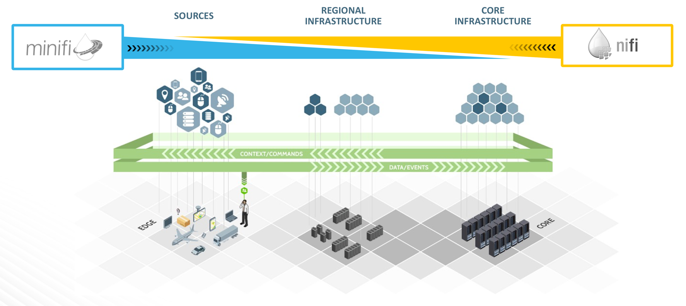

# Khái Niệm Trạm Thời Tiết IoT

## Giới Thiệu

Trong bài giảng về khái niệm này, mục tiêu là cung cấp đủ thông tin nền về mỗi công cụ phần cứng/phần mềm được sử dụng để xây dựng Hệ thống Trạm Thời Tiết IoT này.

## Yêu Cầu Tiên Quyết

- Đọc "Phân Tích Dữ Liệu Trạm Thời Tiết IoT qua Kiến trúc Dữ liệu Kết nối" Tổng quan

## Đề Cương

- Raspberry Pi
- Dịch vụ HDP + HDF
- Trạm Thời Tiết IoT được cung cấp bởi Kiến trúc Dữ liệu Kết nối
- Tóm tắt
- Đọc thêm

## Raspberry Pi

### Raspberry Pi là gì?

Raspberry Pi 3 là một bộ xử lý hoặc máy tính với một nền tảng mã nguồn mở thường được sử dụng từ người mới học lập trình đến các chuyên gia xây dựng Ứng dụng Internet of Things (IoT). Thiết bị nhúng này có một CPU ARMv8 1.2 GHz, 1GB bộ nhớ, tích hợp Wi-Fi và Bluetooth. Raspberry Pi đi kèm với các chân General-Purpose Input/Output (GPIO), cổng in/ra để kết nối thiết bị với các thiết bị ngoại vi bên ngoài như cảm biến, bàn phím, chuột và các thiết bị ngoại vi khác. Như bạn có thể thấy trong Hình 1, Raspberry Pi được kết nối với internet qua cổng Ethernet, một màn hình qua cổng HDMI, bàn phím và chuột qua cổng USB và được cung cấp năng lượng bởi nguồn cung cấp điện 12V. Các phiên bản Linux nhúng đã được tạo cho Raspberry Pi, như Raspbian, Yocto, v.v. Dấu chân nhỏ của Raspberry Pi là ứng cử viên hoàn hảo để chúng ta học cách xây dựng một luồng dữ liệu MiNiFi, thực hiện một số xử lý đơn giản bằng Java hoặc C/C++ và định tuyến dữ liệu đến cụm NiFi từ xa. Do đó, chúng ta có thể tận dụng công cụ Apache mã nguồn mở này để thu thập dữ liệu tại nguồn, nơi nó được tạo ra.

**Hình 1:** Raspberry Pi

### Internet of Things trên Raspberry Pi

Raspberry Pi không chỉ là một nền tảng để xây dựng các dự án IoT, mà nó còn là một nền tảng tuyệt vời để hiểu về IoT. Raspberry Pi là một cách tuyệt vời để có trải nghiệm thực tế với IoT. Theo [IBM Watson Internet of Things](http://www.ibm.com/internet-of-things/partners/raspberry-pi/), nền tảng IoT của Raspberry Pi có thể được sử dụng trong các trường hợp sau: nhà máy, môi trường, thể thao, phương tiện, tòa nhà, nhà ở và bán lẻ. Tất cả các trường hợp sử dụng nền tảng Raspberry Pi IoT đều có chung là dữ liệu được xử lý, điều này có thể dẫn đến tăng năng suất ở nhà máy, các sáng kiến quản lý môi trường tốt hơn, chiến lược thắng lợi trong thể thao, trải nghiệm lái xe tốt hơn, ra quyết định tốt hơn, an toàn và bảo mật cư dân tăng cường và trải nghiệm mua sắm được cá nhân hóa và cải thiện hơn trong bán lẻ.

### Chức Năng Sense HAT

**Hình 2:** Sense HAT

Sense HAT là một bo mạch kết nối với Raspberry Pi. Nó đi kèm với một ma trận LED 8x8, joystick có năm nút và các cảm biến sau: giroscope, accelerometer, magnetometer, nhiệt độ, áp suất khí quyển và độ ẩm.

### Cảm biến Sense HAT đo chính xác gì?

Các cảm biến Sense HAT cho phép người dùng đo hướng bằng cách sử dụng accelerometer 3D, giroscope 3D và magnetometer 3D được kết hợp vào một chip LSM9DS1. Sense HAT cũng chức năng đo áp suất không khí và nhiệt độ thông qua áp suất khí quyển và nhiệt độ được kết hợp vào chip LPS25H. HAT có thể giám sát phần trăm độ ẩm tương quan với nhiệt độ trong không khí qua cảm biến độ ẩm và nhiệt độ HTS221. Tất cả ba cảm biến này đều sử dụng giao thức I2C.

### Lợi ích của Cảm biến I2C là gì?

I2C giúp có thể kết nối nhiều thiết bị với Raspberry Pi, mỗi thiết bị có địa chỉ duy nhất và có thể được đặt bằng cách cập nhật các cài đặt trên Pi. Sẽ dễ dàng kiểm tra xem

 mọi thứ có hoạt động không vì bạn có thể thấy tất cả các thiết bị được kết nối với Pi.

## Dịch vụ HDP + HDF

### Apache MiNiFi

MiNiFi được xây dựng để sống ở cạnh để nhập dữ liệu tại vị trí trung tâm nơi nó được sinh ra, sau đó trước khi dữ liệu đó trở nên quá lớn để xử lý ở cạnh, nó được truyền đến trung tâm dữ liệu của bạn nơi một cụm phân tán NiFi có thể tiếp tục xử lý dữ liệu từ tất cả các thiết bị Raspberry Pi IoT này. MiNiFi có hai phiên bản đều là đại lý Java hoặc C++. Những đại lý này truy cập dữ liệu từ các bộ điều khiển và bộ xử lý nhỏ, chẳng hạn như Raspberry Pi và các thiết bị cấp IoT khác. Ý tưởng đằng sau MiNiFi là có thể đến gần với dữ liệu nhất có thể từ bất kỳ vị trí cụ thể nào, dù là nhỏ đến đâu trên một thiết bị nhúng cụ thể nào đó.

### Apache NiFi

NiFi là một khung ổn định và an toàn để nhập dữ liệu từ các nguồn khác nhau, thực hiện các biến đổi đơn giản trên dữ liệu đó và chuyển nó qua nhiều hệ thống khác nhau. Giao diện người dùng NiFi cung cấp linh hoạt để cho phép các nhóm thay đổi luồng cùng một máy. NiFi sử dụng lưu trữ SAN hoặc RAID cho dữ liệu nó nhập và dữ liệu sự kiện quản lý xác nhận nó tạo ra. Provenance là một bản ghi của các sự kiện trong giao diện người dùng NiFi, thể hiện cách sự kiện biến đổi dữ liệu trong khi dữ liệu chảy qua các thành phần, được biết đến là các xử lý, trong luồng NiFi. NiFi, có kích thước chương trình khoảng 1.2GB, có hơn 250 bộ xử lý để tích hợp tùy chỉnh với các hệ thống và hoạt động khác nhau.

### Hình ảnh về MiNiFi và NiFi trong IoT

**Hình 3:** MiNiFi đến NiFi

### Apache Zookeeper

**Tổng quan**

Zookeeper là một dịch vụ phối hợp mã nguồn mở được thiết kế cho các ứng dụng phân tán. Nó sử dụng một mô hình dữ liệu giống như cấu trúc cây của hệ thống tệp. Với các ứng dụng này, một tập hợp các nguyên tắc được tiết lộ để triển khai các dịch vụ cấp cao cho các trường hợp đồng bộ hóa, bảo trì cấu hình, nhóm và đặt tên. Thông thường, việc xây dựng các dịch vụ phối hợp là khó khăn và dễ xảy ra lỗi như các tình huống đua nhau và tình trạng treo. Mục tiêu với Zookeeper là ngăn chặn các nhà phát triển phải xây dựng các dịch vụ phối hợp từ đầu trong các ứng dụng phân tán.

**Mục Tiêu Thiết Kế**

Zookeeper được thiết kế để đơn giản, có thể nhân bản, được đặt hàng và nhanh chóng. Tỉ lệ đọc/gửi lý tưởng là gần 10:1 dẫn đến việc thực hiện nhanh chóng đối với các công việc làm việc. Giao dịch được duy trì và có thể tích hợp cho các trừng phạt cấp cao. Để phản ánh thứ tự của tất cả các giao dịch, mỗi cập nhật được đánh dấu bằng một số.

**Làm thế nào Dịch vụ Zookeeper Hoạt Động**

Trong một cụm Zookeeper, bạn thường sẽ có các máy chủ hoặc nút tạo nên dịch vụ Zookeeper mà tất cả đều biết đến nhau. Chúng giữ hình ảnh trong bộ nhớ về trạng thái, ghi nhật ký giao dịch và ảnh chụp trong bộ nhớ lưu trữ không dựa vào. Dịch vụ Zookeeper vẫn khả dụng miễn là máy chủ vẫn hoạt động. Quá trình giữa khách hàng và Zookeeper bao gồm khách hàng tạo kết nối với một máy chủ Zookeeper. Khách hàng duy trì kết nối TCP và gửi yêu cầu, nhịp tim cùng với việc nhận câu trả lời và sự kiện xem. Khi Zookeeper sập, khách hàng sẽ kết nối đến máy chủ khác.

### Apache HBase

Apache HBase là một cơ sở dữ liệu noSQL được lập trình bằng Java, nhưng khác với các cơ sở dữ liệu noSQL khác, nó cung cấp tính nhất quán dữ liệu cao khi đọc và ghi. HBase là một cửa hàng dữ liệu khóa/giá trị hướng cột được triển khai để chạy trên Hadoop Distributed File System (HDFS). HBase mở rộng theo chiều ngang trong các cụm tính toán phân tán và hỗ trợ tỷ lệ cập nhật bảng nhanh chóng. HBase tập trung vào khả năng mở rộng, giúp nó xử lý các bảng cơ sở dữ liệu rất lớn. Các kịch bản phổ biến bao gồm các bảng HBase chứa hàng tỷ dòng và triệu cột. Một ví dụ khác là Facebook sử dụng HBase làm trình xử lý dữ liệu có cấu trúc cho cơ sở hạ tầng tin nhắn của họ.

Phần quan trọng của kiến trúc HBase là sử dụng các nút chủ để quản lý các máy chủ vùng phân phối và xử lý các phần dữ liệu của bảng. HBase là một phần của hệ sinh thái Hadoop cùng với các dịch vụ khác như Zookeeper, Phoenix, Zeppelin.

### Apache Phoenix

Apache Phoenix cung cấp tính linh hoạt của khả năng đọc theo hình thức chế biến trễ từ công nghệ NoSQL bằng cách tận dụng HBase làm nền tảng lưu trữ của nó. Phoenix có sức mạnh của SQL tiêu chuẩn và API JDBC với khả năng giao dịch ACID đầy đủ. Phoenix cũng cho phép xử lý giao dịch trực tuyến (OLTP) và phân tích vận hành trong Hadoop đặc biệt cho ứng dụng có độ trễ thấp. Phoenix được tích hợp đầy đủ để làm việc với các sản phẩm khác trong hệ sinh thái Hadoop, như Spark và Hive.

### Apache Zeppelin

Apache Zeppelin là một sổ ghi chú khoa học dữ liệu cho phép người dùng sử dụng trình thông dịch để hiển thị dữ liệu của họ với biểu đồ đường, cột, bánh, phân tán và các biểu đồ khác. Trình thông dịch Phoenix sẽ được sử dụng để hiển thị dữ liệu thời tiết của chúng ta.

## Trạm Thời Tiết IoT được Cung Cấp bởi Kiến Trúc Dữ Liệu Kết Nối

Chúng ta đã nói về từng thành phần trong dự án một cách riêng lẻ, bây giờ hãy thảo luận ở mức cao làm thế nào mỗi thành phần kết nối với nhau.

**Hình 4:** Trạm Thời Tiết IoT và Kiến Trúc Dữ Liệu Kết Nối

**Trạm Thời Tiết IoT tại Raspberry Pi + Sense HAT + MiNiFi**

Trạm Thời Tiết IoT dựa trên Raspberry Pi và Sense HAT. Tại địa điểm này, Raspberry Pi thực hiện một tập lệnh python kiểm soát các cảm biến Sense HAT để tạo dữ liệu thời tiết. MiNiFi là phần mềm đại lý đặt tại Raspberry Pi và hoạt động như một nút cạnh mà hấp thụ dữ liệu nguyên thủy từ cảm biến.

**Kiến Trúc Dữ Liệu Kết Nối tại HDF + HDP Sandbox Nodes**

Sự kết hợp của HDF và HDP tạo nên Kiến Trúc Dữ Liệu Kết Nối. Đối với mục đích prototyping, bạn sẽ chạy một bộ lớp container HDF sandbox và một bộ lớp container HDP sandbox trên một mạng container Docker đang chạy trên máy ảo khách hoặc trực tiếp trên máy chủ của bạn. Cách mà dữ liệu cảm biến vào Kiến Trúc Dữ Liệu Kết Nối là thông qua kết nối MiNiFi với HDF NiFi thông qua Site-To-Site. Giao thức này cho phép các đại lý bên ngoài kết nối vào NiFi bằng cách mở địa chỉ IP của máy chủ và mở một cổng socket. NiFi sẽ được sử dụng để tiền xử lý dữ liệu cảm biến và thêm thông tin địa lý. NiFi được đặt trong Container HDF Sandbox, sau đó kết nối với HBase thông qua Điều Khiển Dịch Vụ Khách Hàng HBase của NiFi. Dịch Vụ Điều Khiển này cho phép NiFi kết nối với một HBase từ xa được đặt trên Container HDP Sandbox thông qua một tệp cấu hình "hbase-site.xml" nói với NiFi nơi HBase đang sống. Zookeeper xử lý các yêu cầu mà NiFi thực hiện khi nó cố gắng kết nối và chuyển dữ liệu đến HBase, nếu Zookeeper gửi cho NiFi một phản hồi rằng nó có thể kết nối với HBase, thì dữ liệu sẽ được lưu trữ trong một bảng HBase. Khi dữ liệu đã được lưu trữ trong HBase, Phoenix được sử dụng để ánh xạ vào bảng HBase. Hiển thị được thực hiện bằng cách sử dụng trình thông dịch Phoenix của

 Zeppelin.

## Tóm Tắt

Chúc mừng, bạn đã hoàn thành bài hướng dẫn về các khái niệm! Bây giờ bạn đã quen với các công nghệ bạn sẽ sử dụng để xây dựng Trạm Thời Tiết IoT.

## Đọc Thêm

- [Tổng Quan về Docker](https://docs.docker.com/engine/docker-overview/)
- [Tài Liệu Docker Engine](https://docs.docker.com/engine/)
- [Dòng Dữ Liệu Hortonworks](https://hortonworks.com/products/data-center/hdf/)
- [Nền Tảng Dữ Liệu Hortonworks](https://hortonworks.com/products/data-center/hdp/)
- [Tổng Quan về Raspberry Pi](https://www.raspberrypi.org/documentation/)
- [Internet of Things 101: Bắt Đầu với Raspberry Pi](https://www.pubnub.com/blog/2015-05-27-internet-of-things-101-getting-started-w-raspberry-pi/)
- [Tài Liệu Sense HAT](https://www.raspberrypi.org/documentation/hardware/sense-hat/)
- [Tổng Quan về Apache NiFi](https://hortonworks.com/apache/nifi/)
- [Tổng Quan về MiNiFi](https://hortonworks.com/blog/edge-intelligence-iot-apache-minifi/)
- [Tổng Quan về Apache HBase](https://hortonworks.com/apache/hbase/)
- [Tổng Quan về Apache Phoenix](https://hortonworks.com/apache/phoenix/)
- [Tổng Quan về Apache Zeppelin](https://hortonworks.com/apache/zeppelin/)
