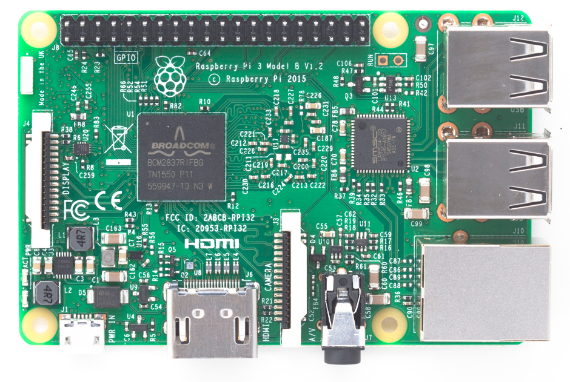
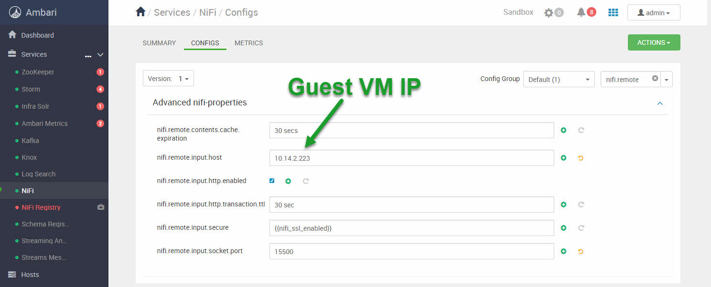
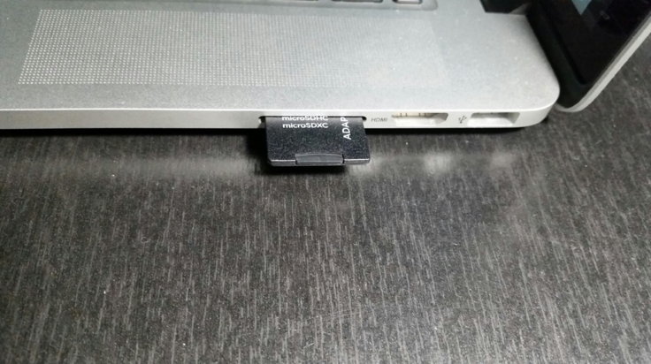
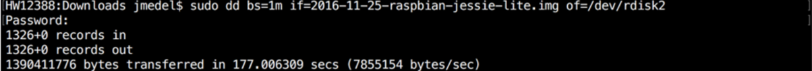
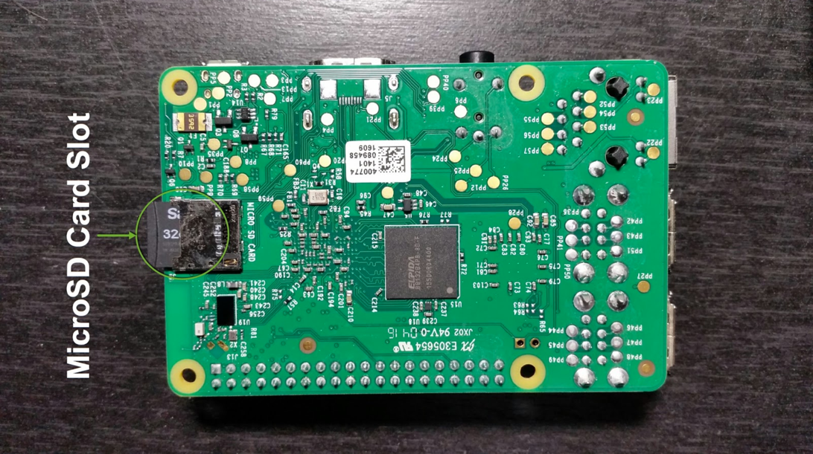

# Triển khai Trạm Thời Tiết IoT và Kiến Trúc Dữ Liệu Kết Nối 

## Giới Thiệu

Trong bài hướng dẫn này, bạn sẽ tạo một Trạm Thời Tiết IoT với một Raspberry Pi và Sense HAT. Ngoài ra, bạn sẽ thêm phân tích dữ liệu cho Nền Tảng Trạm Thời Tiết IoT này với giao tiếp Kiến Trúc Dữ Liệu Kết Nối giữa MiNiFi, HDF Sandbox và HDP Sandbox.

## Tiền Điều Kiện

- Đã kích hoạt Kiến Trúc Dữ Liệu Kết Nối

## Mục Lục

- [Bước 1: Thiết Lập Raspberry Pi Weather Station Node](#bước-1-thiết-lập-raspberry-pi-weather-station-node)
- [Bước 2: Cấu Hình Bridged Adapter Network cho VirtualBox](#bước-2-cấu-hình-bridged-adapter-network-cho-virtualbox)
- [Bước 3: Ánh Xạ Bridged IP đến Hostname Mong Muốn trong File hosts](#bước-3-ánh-xạ-bridged-ip-đến-hostname-mong-muốn-trong-file-hosts)
- [Bước 4: Xác Nhận Đã Đáp Ứng Các Tiền Điều Kiện](#bước-4-xác-nhận-đã-đáp-ứng-các-tiền-điều-kiện)
- [Bước 5: Khởi Động HDF Sandbox và Cấu Hình NiFi Site-To-Site](#bước-5-khởi-động-hdf-sandbox-và-cấu-hình-nifi-site-to-site)
- [Tóm Tắt](#tóm-tắt)
- [Đọc Thêm](#đọc-thêm)
- [Phụ Lục A: Cài Đặt Hệ Điều Hành Raspbian lên Raspberry Pi](#phụ-lục-a-cài-đặt-hệ-điều-hành-raspbian-lên-raspberry-pi)
- [Phụ Lục B: Đặt Lại Thời Gian và Ngày cho Raspberry Pi](#phụ-lục-b-đặt-lại-thời-gian-và-ngày-cho-raspberry-pi)

### Bước 1: Thiết Lập Raspberry Pi Weather Station Node

#### 1.1: Kết Nối Sense HAT với Raspberry Pi

1. Kết nối 40 chân cái của Sense HAT với 40 chân nam của Raspberry Pi.


**Hình 1:** Chân cái 40 của Sense HAT



**Hình 2:** Chân nam 40 của Raspberry Pi


**Hình 3:** Chân cái của Sense HAT được kết nối với chân nam của Raspberry Pi

> Lưu ý: Nếu bạn chưa cài đặt Hệ Điều Hành Raspbian trên Raspberry Pi, tham khảo phần **Phụ Lục A**.

#### 1.2: Cung Cấp Nguồn Cho Raspberry Pi và Thiết Lập Kết Nối Internet

Kết nối Raspberry Pi với nguồn bằng cáp micro USB (có thể là sạc điện thoại) để cung cấp điện và sử dụng cáp Ethernet để kết nối với Internet.


**Hình 4:** Cáp Ethernet của Raspberry Pi Được Kết Nối Để Truy Cập Internet

#### 1.3: SSH vào Raspberry Pi

Sử dụng **Adafruit's Pi Finder** để phát hiện địa chỉ IP của Raspberry Pi, giúp bạn truy cập từ xa. Phương pháp này hoạt động tốt nhất trong một mạng nội bộ.

1. Tải **Adafruit's Pi Finder** cho hệ điều hành tương ứng tại [Adafruit-Pi-Finder Latest Releases](https://github.com/adafruit/Adafruit-Pi-Finder/releases/tag/3.0.0).

2. Mở Raspberry **Pi Finder** và **Click Find My Pi!**:


**Hình 5:** Giao diện của Pi Finder

**Pi Finder** - được sử dụng để phát hiện _địa chỉ IP của Raspberry Pi_ trong môi trường nhà.

3. Kết quả sẽ bao gồm **địa chỉ IP**, **Người Dùng SSH** và **Mật Khẩu SSH** của Raspberry Pi:


**Hình 6:** Pi Finder Found My Pi

4. SSH vào Pi từ máy tính của bạn bằng cách nhấn nút **Terminal**.


**Hình 7:** Giao diện dòng lệnh của Raspberry Pi

#### 1.4: Cài Đặt Phần Mềm Sense HAT Cho Raspberry Pi

Tải và cài đặt phần mềm Sense HAT bằng các lệnh sau:

```bash
sudo apt-get update
sudo apt-get install sense-hat
sudo pip3 install pillow
```

Bây giờ bạn đã có thư viện phần mềm Sense HAT, sẽ sử dụng nó trong bài hướng dẫn tiếp theo để lấy đọc các giá trị cảm biến.

#### 1.5: Cài Đặt MiNiFi Java Agent Cho Raspberry Pi

Trong phần này, bạn sẽ cài đặt Java 8 và JDK 1.8 trên Raspberry Pi vì chúng là yêu cầu để chạy MiNiFi.

Tải và cài đặt Java 8 và JDK1.8:

```bash
sudo apt-get update && sudo apt-get install oracle

-java8-jdk
```

> Lưu ý: Quá trình cài đặt sẽ mất khoảng 10 phút tùy thuộc vào tài nguyên của Hệ Điều Hành Raspbian.

1. Tải MiNiFi Java Agent từ [Apache nifi minifi Downloads](http://nifi.apache.org/minifi/download.html) ở phần **Releases -> MiNiFi (Java) -> Binaries**.

2. Nhấp vào **minifi-[latest-version]-bin.zip**, sau đó tải MiNiFi từ bất kỳ liên kết nào được cung cấp xuống máy tính của bạn.


**Hình 8:** Tải MiNiFi

3. Sử dụng nút **Upload** của Pi Finder để chuyển ứng dụng MiNiFi lên Raspberry Pi. Chọn **minifi-[latest-version]-bin.zip** và nhấp **Open**.


**Hình 9:** Tải MiNiFi lên Raspberry Pi

4. Sử dụng nút **Terminal** của Pi Finder để nhập Raspberry Pi và giải nén dự án MiNiFi.

```bash
unzip minifi-[latest-version]-bin.zip
```

Một MiNiFi Agent đã được cài đặt lên Raspberry Pi. Chúng ta sẽ giải thích thêm về MiNiFi Agent trong bài hướng dẫn tiếp theo.

#### 1.6: Tải MiNiFi Toolkit Lên Máy Tính Của Bạn

Trong phần này, bạn tải MiNiFi toolkit lên máy tính của mình vì nó cần để chuyển đổi luồng NiFi thành định dạng luồng MiNiFi. Trong bài hướng dẫn tiếp theo, bạn sẽ xây dựng luồng MiNiFi trong NiFi.

1. Tải MiNiFi Toolkit từ [Apache nifi minifi Downloads](http://nifi.apache.org/minifi/download.html) ở phần **Releases -> MiNiFi Toolkit Binaries -> [latest-version] - Compatible with MiNiFi Java [latest-version]**.

2. Nhấp vào **minifi-toolkit-[latest-version]-bin.zip** sau đó tải MiNiFi Toolkit từ bất kỳ liên kết nào được cung cấp xuống máy tính của bạn.

3. Di chuyển đến nơi đã tải MiNiFi và giải nén MiNiFi Toolkit bằng phần mềm giải nén yêu thích của bạn.


**Hình 10:** Trích xuất MiNiFi Toolkit

Bây giờ MiNiFi Toolkit sẽ sẵn sàng sử dụng trong bài hướng dẫn tiếp theo.

#### 1.7: Hiệu Chỉnh Múi Giờ Của Raspberry Pi

Tại sao lại quan trọng để hiệu chỉnh múi giờ trên Raspberry Pi?

Để hệ thống của bạn có thời gian và ngày đúng, múi giờ cần được hiệu chỉnh. Một trong những lĩnh vực quan trọng của việc này là trong bài hướng dẫn tiếp theo khi bạn tạo kịch bản Python vẽ dấu thời gian cho mỗi đọc cảm biến.

SSH vào Raspberry Pi bằng nút **Terminal** của Pi Finder của Adafruit.

1. Gõ `sudo raspi-config`

- **raspi-config** được sử dụng để thay đổi cấu hình HĐH và sẽ được sử dụng để hiệu chỉnh ngày/thời gian hiện tại cho múi giờ của bạn


**Hình 11:** Menu chính của raspi-config

2. Chọn **4. Internationalisation Options**. Nhấn "Enter" trên bàn phím.

3. Chọn **I2 Change Timezone**.


**Hình 12:** Menu Tùy Chọn Quốc Tế

4. Chọn khu vực địa lý phù hợp của bạn.

- Ví dụ: US


**Hình 13:** Các Mục Lựa Chọn Khu Vực Địa Lý

5. Chọn múi giờ phù hợp của bạn.

- Ví dụ: Thái Bình Dương


**Hình 14:** Các Mục Lựa Chọn Múi Giờ

6. Bạn sẽ quay lại menu. Chọn **<Finish>**. Thời gian mới được hiệu chỉnh sẽ được hiển thị:


**Hình 15:** Múi Giờ Đã Được Hiệu Chỉnh

### Bước 2: Cấu Hình Bridged Adapter Network Cho VirtualBox

### Người Dùng VirtualBox

Mở Trình quản lý VirtualBox. Nếu máy ảo của bạn đang chạy, bạn cần dừng nó.

1. Nhấp vào biểu tượng **Settings** (Bánh răng cài đặt).

2. Trong cửa sổ mở ra, di chuyển đến tab **Network**.

3. Ở trường **Attached to**, chọn từ menu dropdown **Bridged Adapter**.


**Hình 16:** Thiết lập VirtualBox Guest VM thành Bridged Adapter

> Lưu ý: Bạn có thể giữ nguyên thiết lập mặc định cho Tên của Bridged Network.

4. Đảm bảo trong tab **System** rằng Bộ nhớ cơ bản được thiết lập là **32GB RAM**.

Vì chúng ta đang sử dụng VirtualBox, cả màn hình chào mừng và SSH nằm dưới cả hai phần đầu mục là của VirtualBox. Bạn sẽ thấy bạn có thể truy cập các ứng dụng web từ tên máy chủ, ví dụ: **localhost**, hoặc địa chỉ **IP tường minh**.


**Hình 17:** Màn hình chào mừng VirtualBox Sandbox

### Bước 3: Ánh Xạ Bridged IP đến Hostname Mong Muốn trong File hosts

### Người Dùng Windows

Nhấp vào thanh tìm kiếm của bạn, gõ **notepad**, nhấp chuột phải và chọn **Run as administrator**. Khi cửa sổ xuất hiện, nhấp **yes**.

Trong **notepad**, nhấp vào **file**, **open...**, điều hướng đến đường dẫn **This PC -> WINDOWS(C:) -> Windows -> System32 -> drivers -> etc** và bên cạnh **File name**, nhấp vào dropdown với **Text Documents (*.txt)** và chọn **All Files**.

Chọn tệp **hosts** và **mở** nó.


**Hình 18:** Tệp hosts

Sao chép dòng có địa chỉ IP hiện tại được ánh xạ với các tên máy chủ của sandbox. Ghi chú dòng đó. Sau đó, dán dòng dưới dòng đã được ghi chú.

Trước đó, khi bật sandbox, bạn đã có thể lấy địa chỉ IP từ cửa sổ máy ảo.

Ví dụ, trên VirtualBox, địa chỉ IP **10.14.2.223** là địa chỉ được tạo ra cho phiên làm việc hiện tại trong một không gian văn phòng, nhưng địa chỉ IP của bạn có thể khác.


**Hình 19:** Sửa tệp hosts

Lưu tệp đã sửa đổi, **ctrl + s**.

### Người Dùng Mac

Tương tự như Windows, mở tệp **hosts** tại đường dẫn **/private/etc/hosts**. Sửa đổi tệp với địa chỉ IP Bridged được ánh xạ với các tên máy chủ của sandbox.

Ví dụ, **10.14.2.223** là địa chỉ IP của VirtualBox được tạo ra cho phiên làm việc hiện tại trong một không gian văn phòng, nhưng địa chỉ IP của bạn sẽ khác.

~~~bash
##
# Host Database
#         
# localhost is used to configure the loopback interface
# when the system is booting.  Do not change this entry.
##       
# 127.0.0.1       localhost sandbox-hdp.hortonworks.com sandbox-hdf.hortonworks.com sandbox-host
10.14.2.223       localhost sandbox.hortonworks.com sandbox-hdp.hortonworks.com sandbox-hdf.hortonworks.com
255.255.255.255 broadcasthost
::1             localhost
~~~

Lưu tệp đã sửa đổi.

### Người Dùng Linux

Tương tự như Windows, mở tệp **hosts** tại đường dẫn **/etc/hosts**. Sửa đổi tệp với địa chỉ IP Bridged được ánh xạ với các tên máy chủ của sandbox.

Ví dụ, **10.14.2.223** là địa chỉ IP của VirtualBox Guest VM được tạo ra cho phiên làm việc hiện tại trong một không gian văn phòng, nhưng địa chỉ IP của bạn sẽ khác.

~~~bash
# File is generated from /sandbox/gen-hosts.sh
# Do not remove the following line, or various programs
# that require network functionality will fail.
127.0.0.1         localhost.localdomain localhost sandbox-hdp.hortonworks.com sandbox-hdf.hortonworks.com sandbox-host
10.14.2.223       localhost sandbox.hortonworks.com sandbox-hdp.hortonworks.com sandbox-hdf.hortonworks.com
~~~

Lưu tệp đã sửa đổi.

### Bước 4: Xác Nhận Đã Đáp Ứng Điều Kiện Tiên Quyết

**Thiết lập mật khẩu quản trị Ambari cho "HDF" và "HDP"**

Nếu bạn cần trợ giúp để thiết lập mật khẩu quản trị Ambari,

- Đối với HDP, tham khảo **Admin Password Reset** trong [Hướng dẫn Learning the Ropes of HDP Sandbox](https://hortonworks.com/tutorial/learning-the-ropes-of-the-hortonworks-sandbox/)
- Đối với HDF, tham khảo **Admin Password Reset** trong [Hướng dẫn Learning the Ropes of HDF Sandbox](https://hortonworks.com/tutorial/getting-started-with-hdf-sandbox/)

**Khởi động tất cả các dịch vụ cần thiết cho "HDF" và "HDP"**

Nếu không chắc chắn, đăng nhập vào Bảng điều khiển **admin** của Ambari

- Đối với HDF tại http://sandbox-hdf.hortonworks.com:8080 và xác minh rằng **NiFi** đã khởi động, nếu chưa, hãy khởi động nó.
- Đối với HDP tại http://sandbox-hdp.hortonworks.com:8080 và xác minh rằng **HDFS**, **HBase** và **Zeppelin** đã khởi động, nếu chưa, hãy khởi động chúng.

### Bước 5: Cấu Hình NiFi qua Ambari của HDF

1\. Đăng nhập vào Ambari tại http://sandbox-hdf.hortonworks.com:8080:

> Lưu ý: Tên người dùng/Mật khẩu là **admin** và mật khẩu bạn đã thiết lập.

Bạn sẽ cấu hình giao thức NiFi Site-To-Site bằng cách hiển thị một địa chỉ IP và một cổng socket, để các nút NiFi bên ngoài hoặc các đặc vụ MiNiFi có thể kết nối với nút chủ NiFi.

Chuyển đến **Advanced NiFi-Properties** trong Cài đặt cấu hình của NiFi trong Ambari. Cập nhật các cấu hình sau tương tự như hình ảnh dưới đây:

1\. Nhập **NiFi Service** trong Ambari Stack

2\. Nhập **NiFi Configs**

3\. Lọc tìm kiếm cho `nifi.remote`

4\. Chèn `<địa-chỉ-ip-guest-vm-bridged-của-bạn>` vào **nifi.remote.input.host**. Ví dụ, chúng tôi đã chèn `10.14.2.223`.

5\. Xác minh **nifi.remote.input.http.enabled** đã được kiểm tra

6\. Chèn `15500` vào **nifi.remote.input.socket.port**.

7\. Lưu cấu hình. Ghi chú "Configured NiFi for Socket Site-To-Site"



**Hình 20:** Cập Nhật Cấu Hình NiFi cho Site-to-Site

Bây giờ NiFi đã được cấu hình cho giao thức Socket Site-To-Site. Nếu bạn gặp vấn đề khi triển khai MiNiFi vào luồng NiFi, có thể là do giá trị **nifi.remote.iput.host** đã thay đổi hoặc **nifi.remote.input.socket.port** bạn chọn đã được sử dụng. Tất nhiên, còn nhiều lý do khác gây ra vấn đề, nhưng hai điều này là những điểm cần chú ý.

> Lưu ý: Bây giờ bạn biết nơi tìm địa chỉ IP máy ảo, hãy đặt ánh xạ cho nó đến các tên máy chủ: "[địa-chỉ-ip] sandbox-hdf.hortonworks.com sandbox-hdp.hortonworks.com". Tham khảo "[Learning the Ropes of HDP Sandbox](https://hortonworks.com/tutorial/learning-the-ropes-of-the-hortonworks-sandbox/#environment-setup)".

### 5.1: Khởi động lại NiFi

Khởi động lại NiFi từ Ambari với **nút khởi động màu cam** để các thay đổi có hiệu lực.

### 5.2: Thêm cơ sở dữ liệu GeoLite2 vào HDF Sandbox CentOS

Thêm GeoLite2 vào HDF Sandbox CentOS, đó là một cơ sở dữ liệu chứa địa chỉ IP công cộng được ánh xạ với thông tin địa lý.

1\. Truy cập HDF Web Shell Client tại http://sandbox-hdf.hortonworks.com:4200. Người dùng/Mật khẩu là `root/hadoop`.


**Hình 21:** HDF Web Shell

> Lưu ý: Nếu đây là lần đầu tiên bạn đăng nhập vào Sandbox, bạn sẽ được yêu cầu đổi mật khẩu.

2\. Tạo thư mục cho GeoFile. Thay đổi quyền của thư mục để đảm bảo NiFi có quyền truy cập.

~~~
mkdir -p /sandbox/tutorial-files/820/nifi/input/GeoFile
chmod 777 -R /sandbox/tutorial-files/820/nifi/
~~~

3\. Tải GeoLite2-City.mmdb vào vị trí được chỉ định mà GeoEnrichIP tìm kiếm:

~~~
cd /sandbox/tutorial-files/820/nifi/input/GeoFile
wget http://geolite.maxmind.com/download/geoip/database/GeoLite2-City.tar.gz
tar -zxvf GeoLite2-City.tar.gz
~~~

4\. Lấy đường dẫn đầy đủ đến GeoLite2-City.mmdb:

~~~
cd GeoLite2-City_[date-updated]
ls
pwd
~~~


**Hình 22:** Đường dẫn đến Bảng tra cứu Geolite "GeoLite2-City.mmdb"

Ghi chú lại tên thư mục mà GeoLite2-City.mmdb đang ở trên hệ thống của bạn. Theo hình ảnh trên, đường dẫn đầy đủ là: `/sandbox/tutorial-files/820/nifi/input/GeoFile/GeoLite2-City_20180605/GeoLite2-City.mmdb`

> Lưu ý: GeoLite2-City_[date-updated] theo hình ảnh trên là GeoLite2-City_20170704. Tuy nhiên, khi bạn tải tệp DB GeoLite, [date-updated] của bạn có thể khác với 20170704, nên nếu cần, hãy cập nhật đường dẫn đầy đủ.

Đường dẫn đầy đủ này sẽ được sử dụng trong một hướng dẫn sau khi bạn mở rộng Luồng NiFi để lấy thông tin địa lý.

## Tóm Tắt

Chúc mừng! Bạn đã biết cách thiết lập Trạm Thời tiết IoT của riêng mình bằng cách sử dụng Raspberry Pi, Sense HAT, MiNiFi, HDF Sandbox và HDP Sandbox. Bạn cũng quen thuộc với cách cài đặt MiNiFi lên Raspberry Pi. Bạn cũng đã bắt đầu thiết lập Kiến trúc Dữ liệu Kết nối giữa các nút HDF và HDP SB trong Mạng Docker. Trong các hướng dẫn tiếp theo, bạn sẽ tập trung vào xử lý trước dữ liệu, lưu trữ dữ liệu vào một cơ sở dữ liệu NoSQL và phân tích dữ liệu theo thời gian thực khi nó lưu vào cơ sở dữ liệu.

## Đọc Thêm

- Tìm hiểu cách cài đặt hệ điều hành Raspbian qua [Hướng dẫn Phần mềm Raspberry Pi chính thức](https://www.raspberrypi.org/learning/software-guide/quickstart/)
- Tìm hiểu cách khám phá Pi Finder qua [Hướng dẫn Adafruit Raspberry Pi Finder](https://learn.adafruit.com/the-adafruit-raspberry-pi-finder/overview)
- Khám phá chức năng của từng chân thông qua [Sơ đồ Chân Raspberry Pi](http://www.jameco.com/Jameco/workshop/circuitnotes/raspberry_pi_circuit_note_fig2a.jpg)

### Phụ lục A: Cài Đặt Hệ Điều Hành Raspbian Trên Raspberry Pi

Đối với người dùng cần trợ giúp cài đặt hệ điều hành Raspbian lên Raspberry Pi của họ, chúng tôi đã cung cấp một thủ tục chi tiết. Trước tiên, bạn chèn thẻ microSD vào máy tính của mình, sau đó tải hình ảnh OS Raspbian xuống máy tính của bạn. Chúng tôi sẽ hướng dẫn bạn qua hai cách để tạo hệ điều hành Raspbian có thể khởi động được. Phương pháp 1 sử dụng chương trình đồ họa Etcher SD Card Image Utility GUI thay vì dòng lệnh. 

Phần cứng được đề xuất:

- [Danh sách Điện tử Trạm Thời tiết IoT](http://a.co/8FNMlUu)

### Đặt thẻ microSD vào Máy Tính

1\. Kết nối MicroSD với Bộ chuyển đổi microSD.


**Hình 23:** MicroSD ở bên trái và Bộ chuyển đổi thẻ microSD ở bên phải

2\. Chèn Bộ chuyển đổi thẻ microSD vào máy tính.



**Hình 24:** Bộ chuyển đổi thẻ microSD đã chèn vào máy tính

### Tải Hình ảnh OS Raspbian

3\. Tải [Hình ảnh Raspbian Jessie Lite OS](https://www.raspberrypi.org/downloads/raspbian/) xuống máy chủ của bạn.

4\. Giải nén Hình ảnh OS.

### Phương pháp 1: Tạo Hệ điều Hành Raspbian có Thể Khởi động được trên Thẻ microSD với Etcher.io

Bạn sẽ tạo một hệ điều hành Raspbian có thể khởi động được trên thẻ microSD bằng cách sử dụng chương trình cài đặt đồ họa etcher.io thay vì dòng lệnh.

1\. Tải xuống và cài đặt công cụ ảnh thẻ SD Etcher từ etcher.io

2\. Sử dụng Etcher để chuyển hình ảnh Raspbian vào vị trí của thẻ SD của bạn. **Chọn Ảnh** của Hệ điều Hành Raspbian từ vị trí tải về, sau đó **Chọn Ổ đĩa** (thẻ microSD của bạn có thể đã được chọn sẵn theo mặc định) và chọn **Flash!** để tạo Ảnh Flash có thể khởi động được trên thẻ microSD.


**Hình 25:** Bảng điều khiển Etcher để Tạo Hệ điều Hành có thể Khởi động được trên thẻ microSD


**Hình 26:** Quá trình Flash đã Hoàn Thành, Bây giờ đã Tạo được Hệ điều hành có thể Khởi động được

Sau khi thao tác hoàn thành, Etcher tự động hủy kết nối thẻ SD và có thể an toàn để rút ra.

### Phương pháp 2: Tạo Hệ điều hành Raspbian có Thể Khởi động được trên Thẻ microSD với CLI (MAC/Linux)

1\. Xem danh sách tất cả các thiết bị được gắn vào máy tính bằng lệnh:

```bash
df
```

2\. Ghi chú đường dẫn thiết bị được liệt kê bên cạnh phân vùng, tìm phân vùng mới nhất được thêm vào, có thể có đường dẫn **/Volumes/BOOT** dưới cột **Mounted On**.

3\. Mở Tiện ích Ổ đĩa, chọn thẻ SD, sau đó nhấn **Unmount** để chúng ta có thể ghi vào toàn bộ thẻ.


**Hình 27:** Tiện ích Disk Utility MAC để Unmount Thiết bị để Ghi vào Nó

4\. Chuyển đến terminal, trong thư mục Downloads nơi bạn đã lưu Hình ảnh Raspbian, chạy lệnh DD để ghi một hệ điều hành Raspbian có thể khởi động được lên thẻ microSD:

```bash
sudo dd bs=1m if=2017-02-16-raspbian-jessie-lite.img of=/dev/rdisk2
```

> **Chú ý:** Giải thích về ba đối số được sử dụng trong lệnh dd: **bs = kích thước block**, **if = vị trí của tệp đầu vào raspbian**, **of = vị trí của tệp đầu ra thiết bị ngoại vi**. Lưu ý là trong đối số **of=**, phân vùng thẻ SD thay đổi từ disk2s1 thành rdisk2 để đảm bảo toàn bộ thẻ SD được nạp, không chỉ phần vùng.

Thao tác DD sẽ mất từ 1 đến 5 phút cho đến khi hoàn tất.



**Hình 28:** Tiến độ Tạo Hệ điều Hành có thể Khởi động được trên thẻ microSD

Sau khi thao tác dd hoàn thành, bạn sẽ thấy Hệ điều hành Raspbian có thể khởi động được đã được chuyển thành thẻ SD.

5\. Để thiết lập một Raspberry Pi không đầu, có thể kích hoạt SSH bằng cách đặt một tệp có tên **ssh** vào thư mục gốc của phân vùng BOOT, dưới đây là một ví dụ về cách thực hiện điều này:

```bash
boot jmedel$ pwd
boot jmedel$ touch ssh
boot jmedel$ ls
COPYING.linux           bcm2708-rpi-cm.dtb    cmdline.txt   fixup_x.dat   ssh
LICENCE.broadcom        bcm2709-rpi-2-b.dtb   config.txt    issue.txt     start.elf
LICENSE.oracle          bcm2710-rpi-3-b.dtb   fixup.dat     kernel.img    start_cd.elf
bcm2708-rpi-b-plus.dtb  bcm2710-rpi-cm3.dtb   fixup_cd.dat  kernel7.img   start_db.elf
bcm2708-rpi-b.dtb       bootcode.bin          fixup_db.dat  overlays      start_x.elf
```

**Hình 29:** Tạo Tệp SSH để Kích hoạt Truy cập SSH đến Raspberry Pi

> **Chú ý:** Đường dẫn đến thẻ SD là `/Volumes/boot`. `touch ssh` tạo một tệp mới. `ls -ltr` xác minh rằng tệp mới đã được tạo.

6\. Đẩy thẻ microSD Adapter và rút nó ra khỏi máy tính của bạn. Chèn thẻ microSD vào khe cắm thẻ microSD của Raspberry Pi.



**Hình 30:** MicroSD Đã chèn vào Raspberry Pi

7\. Kết nối dây cáp Ethernet với Raspberry Pi để cung cấp truy cập internet, kết nối 5V để cung cấp điện và Pi sẽ bắt đầu khởi động.


**Hình 31:** Cáp Ethernet Raspberry Pi đã Kết nối để Truy cập Internet

Thông tin đăng nhập mặc định của Pi:

```bash
tên người dùng/mật khẩu = pi/raspberry
```

> **Chú ý:** Bạn sẽ cần mật khẩu để truy cập SSH vào Raspberry Pi.
