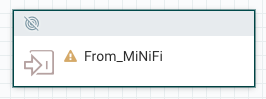
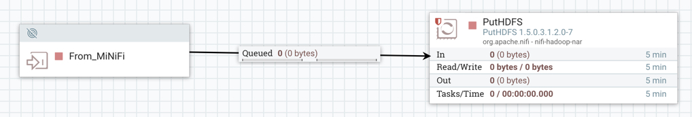
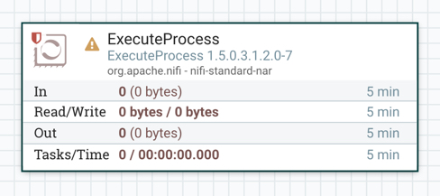
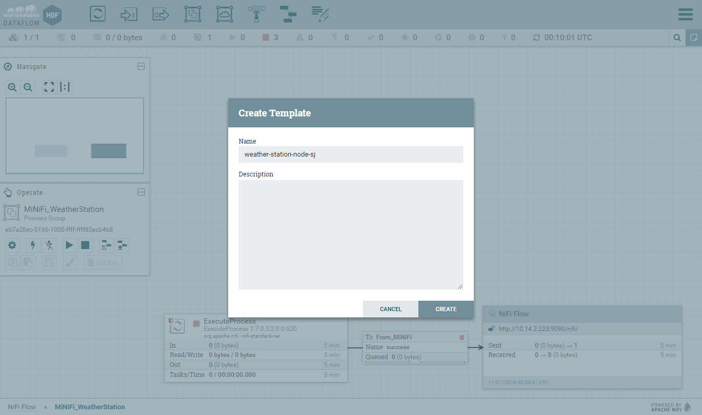
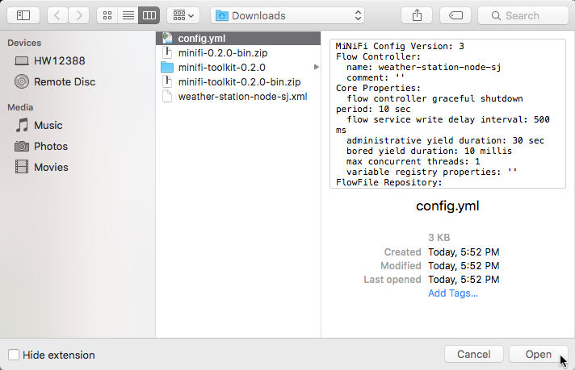
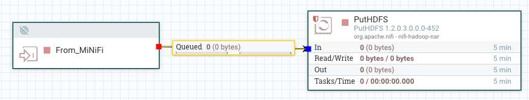
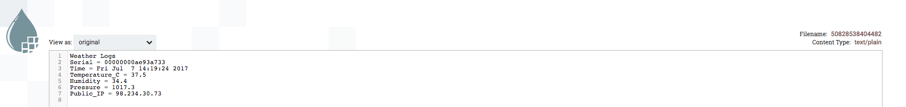

# Thu thập Dữ liệu thời tiết từ Sense HAT thông qua CDA

## Giới thiệu

Bạn sẽ học cách tạo một chương trình Python để thu thập đọc cảm biến từ Raspberry Pi Sense HAT cho nhiệt độ, độ ẩm và áp suất khí quyển. Bạn cũng sẽ chạy MiNiFi trên Raspberry Pi để tiếp nhận các đọc cảm biến thời tiết và chuyển tiếp chúng đến vị trí của NiFi trên HDF sandbox thông qua giao thức Site-to-Site. Cuối cùng, bạn sẽ xác minh rằng NiFi có thể liên lạc với HDP bằng cách lưu trữ dữ liệu vào Hệ thống Tệp phân tán Hadoop (HDFS).

## Tiền điều kiện

- Triển khai Trạm thời tiết IoT và Kiến trúc Dữ liệu Kết nối

## Kế hoạch

- [Bước 1: Tạo Kịch bản Python để Ghi Dữ liệu Thời tiết Sense HAT](#bước-1-tạo-kịch-bản-python-để-ghi-dữ-liệu-thời-tiết-sense-hat)
- [Bước 2: Xây dựng Luồng NiFi để Lưu trữ Dữ liệu MiNiFi vào HDFS](#bước-2-xây-dựng-luồng-nifi-để-lưu-trữ-dữ-liệu-minifi-vào-hdfs)
- [Bước 3: Xây dựng Luồng MiNiFi để Đẩy Dữ liệu đến NiFi](#bước-3-xây-dựng-luồng-minifi-để-đẩy-dữ-liệu-đến-nifi)
- [Tóm tắt](#tóm-tắt)
- [Đọc thêm](#đọc-thêm)
- [Phụ lục A: Khắc phục sự cố MiNiFi đến NiFi Site-to-Site](#phụ-lục-a-khắc-phục-sự-cố-minifi-đến-nifi-site-to-site)

### Bước 1: Tạo Kịch bản Python để Ghi Dữ liệu Thời tiết Sense HAT

Bạn sẽ học cách tạo một kịch bản Python trên Raspberry Pi để thu thập dữ liệu thời tiết từ Sense HAT. Có hai cách tiếp cận: **Cách tiếp cận 1** bạn sẽ triển khai kịch bản Python từng bước một trong khi **Cách tiếp cận 2** bạn sẽ tải kịch bản Python lên Raspberry Pi.

#### Cách tiếp cận 1: Triển khai Kịch bản Python lên Raspberry Pi

Chúng tôi sẽ giải thích từng phần của mã và ý nghĩa của chúng trong dự án từ 1.1 - 1.6. Ở 1.7, mã đầy đủ cho WeatherStation được cung cấp.

Mở HDF Sandbox Web Shell:

http://sandbox-hdf.hortonworks.com:4200

Tạo một tệp mới "WeatherStation.py"

```bash
touch WeatherStation.py
vi WeatherStation.py
```

Bây giờ bạn đã sẵn sàng bắt đầu thêm mã vào tệp văn bản của mình.

#### 1.1: Thu thập Số sê-ri của Raspberry Pi

Số sê-ri sẽ được sử dụng để phân biệt mỗi Trạm thời tiết Raspberry Pi.

```python
# Cố gắng lấy Số sê-ri của Raspberry Pi
serial = get_serial()
```

Mã gọi hàm **get_serial()** và lưu số sê-ri của Raspberry Pi vào biến **serial**.

```python
# Lấy Số sê-ri của Raspberry Pi
def get_serial():
  # Trích xuất số sê-ri từ tệp cpuinfo
  cpuserial = "0000000000000000"
  try:
    f = open('/proc/cpuinfo','r')
    for line in f:
      # Kiểm tra xem ký tự từ 0 đến 6 có khớp với Serial không
      if line[0:6]=='Serial':
        # sau đó gán cpuserial với các ký tự từ 10 đến 26 của dòng
        cpuserial = line[10:26]
      # lặp đến dòng tiếp theo trong đối tượng tệp cpuinfo f
    f.close()
  except:
    cpuserial = "ERROR000000000"
  return cpuserial
```

Hàm **get_serial()** sau đó tìm kiếm tệp `/proc/cpuinfo` để tìm từ khóa **Serial**. Khi từ khóa này được tìm thấy, số sê-ri của CPU được lưu vào biến **cpuserial**.

#### 1.2: Thu thập Dấu thời gian cho Đọc cảm biến

Dấu thời gian cho biết thời gian khi đọc cảm biến được thực hiện.

```python
# Lấy Thời gian hiện tại được ưa chuộng bởi OS
timestamp = get_time()
```

Mã gọi hàm **get_time()** và lưu thời điểm hiện tại vào biến **timestamp**.

```python
# Lấy Thời gian hiện tại được ưa chuộng bởi OS
def get_time():
  current_time = datetime.datetime.now().strftime("%Y-%m-%dT%H:%M:%SZ")
  return current_time
```

Bên trong hàm **get_time()**, **datetime.datetime.now()** truy xuất ngày và giờ hiện tại được ưa chuộng bởi hệ điều hành, sau đ

ó **strftime("%Y-%m-%dT%H:%M:%SZ")** định dạng ngày giờ theo năm, tháng, ngày, được phân tách bởi ký tự 'T' để chỉ thời gian của ngày trong giờ, phút và giây. Giá trị ngày giờ đã được định dạng này được trả về cho **current_time** dưới dạng chuỗi.

#### 1.3: Thu thập Đọc cảm biến thời tiết từ Sense HAT

Nhiệt độ, độ ẩm và áp suất khí quyển được trích xuất từ Sense HAT. **sense.get_temperature** lấy giá trị nhiệt độ và lưu vào biến **temp_c**.

```python
# Cố gắng lấy đọc cảm biến.
temp_c = sense.get_temperature()
humidity_prh = sense.get_humidity()
humidity_prh = round(humidity_prh, 2)
pressure_mb = sense.get_pressure()
pressure_mb = round(pressure_mb, 2)
```

#### 1.4: Thử hiệu chỉnh Đọc cảm biến nhiệt độ Sense HAT

Các giá trị Đọc cảm biến nhiệt độ Sense HAT bị chệch so với nhiệt độ thực tế do CPU của Raspberry Pi phát ra nhiệt ở xung quanh Sense HAT. Nhiệt độ nhân CPU của Raspberry Pi phát ra 55.8 Celsius (132.44 Fahrenheit). Do đó, để có thể thu thập dữ liệu hữu ích từ cảm biến nhiệt độ, chúng ta phải thử hiệu chỉnh cảm biến.

```python
# Lấy Nhiệt độ Lõi CPU của Raspberry Pi
cpu_temp_c = get_cpu_temp_c()

# Hiệu chỉnh Đọc cảm biến Nhiệt độ Sense HAT
temp_c = calibrate_temp_c(cpu_temp_c, temp_c)
temp_c = round(temp_c, 2)
```

Trong mã trên, hàm **get_cpu_temp_c()** được gọi để có được nhiệt độ CPU, sau đó kết quả đó được lưu vào biến **cpu_temp_c**.

Biến **temp_c** được ghi đè bằng giá trị nhiệt độ Sense HAT đã được hiệu chỉnh bằng cách gọi hàm **calibrate_temp_c(cpu_temp_c, temp_c)**.

```python
# Lấy Nhiệt độ Lõi CPU của Raspberry Pi qua lệnh shell "vcgencmd"
def get_cpu_temp_c():
  cpu_temp = subprocess.check_output("vcgencmd measure_temp", shell=True)
  # Phân tách một Chuỗi và thêm dữ liệu vào mảng chuỗi bằng bộ phân cách "="
  array = cpu_temp.split("=")
  array2 = array[1].split("'")
  # Lấy giá trị nhiệt độ từ phần tử 0 của mảng2
  cpu_tempc = float(array2[0])
  cpu_tempc = float("{0:.2f}".format(cpu_tempc))
  return cpu_tempc

# Đọc cảm biến Nhiệt độ Sense HAT bị chệch do nhiệt độ của CPU
# Hiệu chỉnh đọc cảm biến nhiệt độ bằng cách sử dụng hệ số tỷ lệ: 5.466
# Hệ số tỷ lệ là số độ mà Sense HAT bị chệch so với nhiệt độ thực tế
def calibrate_temp_c(cpu_tempc, temp_c):
  temp_c - ((cpu_tempc - temp_c)/5.466)
  return temp_c
```

Hàm **get_cpu_temp_c()** lưu đầu ra nhiệt độ CPU của Raspberry Pi từ lệnh shell "vcgencmd measure_temp" vào biến **cpu_temp**. Vì lệnh shell này xuất nhiệt độ CPU dưới dạng "temp=50.5'C", hai biến mảng (**array**, **array2**) được sử dụng để phân tách chuỗi và lấy giá trị nhiệt độ CPU, chẳng hạn như "50.5". Giá trị được trả về mỗi khi người dùng gọi hàm này.

**calibrate_temp_c(cpu_temp_c, temp_c)** nhận làm tham số: cpu_temp_c và temp_c, sau đó tính toán giá trị nhiệt độ Sense HAT đã hiệu chỉnh hơn trong khi tính đến hệ số tỷ lệ: 5.466. Hệ số tỷ lệ là số độ Sense HAT bị chệch so với nhiệt độ thực tế ở một vị trí cụ thể. Hãy nhớ rằng Nhiệt độ Sense HAT có thể vẫn chưa đúng so với nhiệt độ thực tế vì Sense HAT vẫn ở gần nhiệt độ CPU.

Nếu bạn quan tâm đến việc biết thêm về cách tính hệ số tỷ lệ, hãy đọc đoạn văn sau, nếu không, chuyển đến 1.5.

Giá trị hệ số tỷ lệ, chẳng hạn như 5.466, có thể được lấy bằng cách ghi lại đọc nhiệt độ thực tế (ví dụ: cảm biến DHT22) nhiều lần trong khoảng thời gian 24 giờ. Đồng thời, bạn cũng sẽ ghi lại đọc nhiệt độ từ Sense HAT. Sau đó, bạn sẽ lấy tất cả các giới thiệu về nhiệt độ thực tế, tính giá trị trung bình và trừ nó đi từ giới thiệu trung bình của Sense HAT. Kết quả của hệ số tỷ lệ sẽ hiển thị số độ Sense HAT chệch so với nhiệt độ thực tế.

#### 1.5: Thu thập Địa chỉ IP Công cộng của Raspberry Pi

Địa chỉ IP Công cộng của Raspberry Pi có thể được sử dụng để xác định thông tin địa lý, chẳng hạn như thành phố và tiểu bang nơi nút đó ghi lại dữ liệu thời tiết.

Mã trích xuất Địa chỉ IP Công cộng thông qua cuộc gọi REST đến IPIFY và sau đó phân tích cú pháp JSON để lấy giá trị **ip**.

```python
# Cố gắng lấy IP Công cộng
public_ip = get_public_ip()
```

Mã trên gọi hàm **get_public_ip()** và lưu Địa chỉ IP Công cộng của Raspberry Pi vào biến **ip**.

```python
# Lấy Địa chỉ IP Công cộng của Raspberry Pi qua Cuộc gọi REST IPIFY
def get_public_ip():
  ip = json.load(urllib2.urlopen('https://api.ipify.org/?format=json'))['ip']
  return ip
```

Bên trong hàm **get_public_ip()**, **urllib2.urlopen('https://api.ipify.org/?format=json')** mở URL của yêu cầu HTTP IPIFY, trả về Địa chỉ IP Công cộng của Raspberry Pi dưới dạng một đối tượng giống như tệp. **json.load()** đọc dữ liệu từ đối tượng giống như tệp, sau đó **['ip']** được đính kèm vào cuối **json.load()** là một Biểu thức JSONPath được sử dụng để trích xuất giá trị địa chỉ IP và lưu vào biến **ip**. Mỗi khi người dùng gọi **get_public_ip()**, họ sẽ nhận được Địa chỉ IP Công cộng của Raspberry Pi.

#### 1.6: In các giá trị Thuộc tính Thời tiết ra màn hình

Với các câu lệnh in, giá trị biến có thể được đầu ra ra đầu ra tiêu chuẩn và hiển thị trên màn hình:

```python
print "Serial = " + str(serial)
print "Time = \"" + str(timestamp) + "\""
print "Temperature_F = " + str(temp_f)
print "Humidity_PRH = " + str(humidity_prh)
print "Pressure_In = " + str(pressure_in)
print "Public_IP = " + str(public_ip)
```
### 1.7: Viết Chương trình Python WeatherStation.py (Mã nguồn đầy đủ có sẵn)

Khi "WeatherStation.py" được thực thi, nó xuất dữ liệu cảm biến thời tiết cho nhiệt độ, độ ẩm và áp suất vào đầu ra tiêu chuẩn trong cửa sổ console. Ngoài ra, số sê-ri của trạm thời tiết Raspberry Pi, địa chỉ IP công cộng và thời gian đọc cảm biến cũng được xuất ra đầu ra tiêu chuẩn. Chúng tôi sẽ không sử dụng ma trận RGB LED 8x8 của Sense HAT để hiển thị các giá trị cảm biến.

1. Mở Terminal của Raspberry Pi bằng cách sử dụng nút **Terminal** trong Pi Finder.

2. Tạo một tệp mới với tên `WeatherStation.py`

3. Nhập mã sau vào trình chỉnh sửa văn bản yêu thích của bạn.

4. Lưu tệp.

```python
#!/usr/bin/python

# Thư viện
import json
import sys
import time
import datetime
import urllib2
import subprocess
from sense_hat import SenseHat

# Lấy Số sê-ri Raspberry Pi
def get_serial():
  # Trích xuất số sê-ri từ tệp cpuinfo
  cpuserial = "0000000000000000"
  try:
    f = open('/proc/cpuinfo','r')
    for line in f:
      # Kiểm tra ký tự dòng từ 0 đến 6 có khớp với Sê-ri không
      if line[0:6]=='Serial':
        # sau đó gán cpuserial với ký tự dòng từ 10 đến 26
        cpuserial = line[10:26]
      # lặp đến dòng tiếp theo trong đối tượng tệp cpuinfo f
    f.close()
  except:
    cpuserial = "ERROR000000000"
  return cpuserial

# Lấy Thời gian hiện tại theo ưa thích của HĐH
def get_time():
  # Gán ngày giờ theo định dạng năm-tháng-ngày-T-giờ-phút-giây
  current_time = datetime.datetime.now().strftime("%Y-%m-%dT%H:%M:%SZ")
  return current_time

# Lấy Địa chỉ IP Công cộng của Raspberry Pi qua Cuộc gọi REST IPIFY
def get_public_ip():
  ip = json.load(urllib2.urlopen('https://api.ipify.org/?format=json'))['ip']
  return ip

# Lấy Nhiệt độ Lõi CPU của Raspberry Pi qua lệnh shell "vcgencmd"
def get_cpu_temp_c():
  cpu_temp = subprocess.check_output("vcgencmd measure_temp", shell=True)
  # Phân tách một Chuỗi và thêm dữ liệu vào mảng chuỗi bằng bộ phân cách "="
  array = cpu_temp.split("=")
  array2 = array[1].split("'")
  # Lấy giá trị nhiệt độ từ phần tử 0 của mảng2
  cpu_tempc = float(array2[0])
  cpu_tempc = float("{0:.2f}".format(cpu_tempc))
  return cpu_tempc

# Đọc cảm biến Nhiệt độ Sense HAT bị chệch do nhiệt độ của CPU
# Hiệu chỉnh đọc cảm biến nhiệt độ bằng cách sử dụng hệ số tỷ lệ: 5.466
# Hệ số tỷ lệ là số độ mà Sense HAT bị chệch so với nhiệt độ thực tế
def calibrate_temp_c(cpu_tempc, temp_c):
  temp_c - ((cpu_tempc - temp_c)/5.466)
  return temp_c

# Chuyển đổi Nhiệt độ Celsius thành Fahrenheit
def convert_c_to_f(temp_c):
  temp_f = temp_c * 9.0 / 5.0 + 32.0
  return temp_f

# Chuyển đổi Áp suất Millibars thành Inches
def convert_mb_to_in(pressure_mb):
  pressure_in = 0.0295301*(pressure_mb)
  return pressure_in

def main():
  # Khởi tạo SenseHat
  sense = SenseHat()
  sense.clear()
  print 'Weather Logs'

  # Lấy Số sê-ri Raspberry Pi
  serial = get_serial()

  # Lấy Thời gian hiện tại theo ưa thích của HĐH
  timestamp = get_time()

  # Lấy Đọc cảm biến thời tiết từ Cảm biến Môi trường
  temp_c = sense.get_temperature()
  humidity_prh = sense.get_humidity()
  humidity_prh = round(humidity_prh, 2)
  pressure_mb = sense.get_pressure()
  pressure_mb = round(pressure_mb, 2)

  # Lấy Nhiệt độ Lõi CPU Raspberry Pi
  cpu_temp_c = get_cpu_temp_c()

  # Hiệu chỉnh Đọc cảm biến Nhiệt độ Sense HAT
  temp_c = calibrate_temp_c(cpu_temp_c, temp_c)
  temp_c = round(temp_c, 2)

  # Chuyển đổi Nhiệt độ thành Fahrenheit và Áp suất thành Inches
  temp_f = convert_c_to_f(temp_c)
  temp_f =

 round(temp_f, 2)
  pressure_in = convert_mb_to_in(pressure_mb)
  pressure_in = round(pressure_in, 2)

  # Lấy Địa chỉ IP Công cộng
  public_ip = get_public_ip()

  # 8x8 RGB
  #sense.clear()
  #info = 'Temperature (C): ' + str(temp) + 'Humidity: ' + str(humidity) + 'Pressure: ' + str(pressure)
  #sense.show_message(info, text_colour=[255, 0, 0])

  # In Dữ liệu Thời tiết
  print "Serial = " + str(serial)
  print "Time = \"" + str(timestamp) + "\""
  print "Temperature_F = " + str(temp_f)
  print "Humidity_PRH = " + str(humidity_prh)
  print "Pressure_In = " + str(pressure_in)
  print "Public_IP = " + str(public_ip)

if __name__ == "__main__":
  main()
```

### Cách tiếp cận 2: Tải Kịch bản Python lên Raspberry Pi

Chúng tôi cung cấp một liên kết tải xuống cho tệp WeatherStation.py.

### Tải xuống Kịch bản Python weather-station.py

1. Tải xuống [kịch bản WeatherStation.py](assets/WeatherStation.py) trên máy tính của bạn.

2. Tải lên **WeatherStation.py** lên Raspberry Pi của bạn bằng cách sử dụng nút **Tải lên** của Pi Finder.

### Bước 2: Xây dựng Luồng NiFi để Lưu trữ Dữ liệu MiNiFi vào HDFS

### 2.1: Xây dựng NiFi đến HDFS

Trong phần này, bạn sẽ xây dựng một luồng NiFi trên nút HDF Sandbox để chuyển dữ liệu được chuyển đến từ nút MiNiFi đến HDFS trên nút HDP Sandbox.

1. Truy cập giao diện người dùng NiFi tại http://sandbox-hdf.hortonworks.com:9090/nifi/


**Hình 1:** Canvas giao diện người dùng NiFi

> Lưu ý: Nếu Canvas NiFi có một luồng hiện có, hãy xóa nó và chúng ta sẽ xây dựng một luồng hoàn toàn khác biệt.

2. Trong NiFi, thêm một Cổng Nhập  vào Canvas và đặt tên là `From_MiNiFi`.



**Hình 2:** Cổng Nhập "From_MiNiFi" NiFi lắng nghe để nhận dữ liệu đầu vào

3. Thêm một **PutHDFS** processor  vào Canvas. Nhấp chuột phải vào bộ xử lý **PutHDFS** để cấu hình các thuộc tính bằng cách thêm các thuộc tính được chỉ định trong **Bảng 1**:

**Bảng 1: Các Giá trị Thuộc tính PutHDFS**

| Thuộc tính | Giá trị    |
| :------------- | :------------- |
| Tệp cấu hình Hadoop     | `/etc/hadoop/conf/core-site.xml`  |
| Thư mục     | `/sandbox/tutorial-files/820/nifi/output/raw-data`  |


**Hình 3:** Tab Thuộc tính PutHDFS

**Lưu ý:** Mở HDP Web Shell Client tại http://sandbox-hdp.hortonworks.com:4200. Tạo thư mục HDFS được chỉ định trong Bảng thuộc tính trên.

~~~bash
sudo -u hdfs hdfs dfs -mkdir -p /sandbox/tutorial-files/820/nifi/output/raw-data
sudo -u hdfs hdfs dfs -chmod -R 777 /sandbox/tutorial-files/820/nifi/output/raw-data
~~~

Trong tab **Cài đặt**, dưới Mối quan hệ Kết thúc Tự động, kiểm tra các ô **failure** và **success**. Mối quan hệ này sẽ xóa các tệp luồng liệu dữ liệu có hoặc không được ghi thành công vào HDFS để làm sạch dữ liệu dư thừa khi đạt đến cuối luồng.

 

**Hình 4:** Tab Cài đặt PutHDFS

Sau đó, nhấp vào **Áp dụng** để áp dụng thay đổi.

4. Di chuột qua cổng nhập **From_MiNiFi**, một mũi tên sẽ xuất hiện, nhấp vào cổng và kéo để tạo kết nối đến **PutHDFS**. Một đường kẻ đứt đỏ sẽ xuất hiện và khi con trỏ chuột nằm trên bộ xử lý **PutHDFS** nó sẽ chuyển sang màu xanh, hãy thả chuột để thiết lập kết nối. Sau đó, nhấp vào **THÊM**.



**Hình 5:** Kết nối từ cổng nhập **From_MiNiFi** đến **PutHDFS** chuyển dữ liệu từ biên đến HDF đến HDP

Bây giờ bạn sẽ xây dựng luồng MiNiFi trong NiFi.

### Bước 3: Xây dựng Luồng MiNiFi để Đẩy Dữ liệu đến NiFi

Bạn sẽ xây dựng luồng MiNiFi bằng cách sử dụng NiFi, sau đó sử dụng bộ công cụ MiNiFi để chuyển đổi luồng NiFi thành luồng MiNiFi. Sau đó, bạn sẽ tải lên luồng MiNiFi lên Raspberry Pi bằng tính năng Tải lên của Adafruit's Pi Finder. Luồng MiNiFi sẽ thu thập dữ liệu từ cảm biến Sense HAT đang chạy trên Raspberry Pi.
### 3.1: Xây dựng Luồng MiNiFi bằng cách Sử dụng NiFi

1. Kéo biểu tượng Nhóm Xử lý  vào NiFi canvas và đặt tên Nhóm Xử lý là: `MiNiFi_WeatherStation`. Nhấp vào **ADD**.


**Hình 6:** Nhóm Xử lý cho luồng dữ liệu MiNiFi

2. Nhấp đúp để nhập Nhóm Xử lý này mới. Thêm bộ xử lý **ExecuteProcess** lên NiFi canvas.



**Hình 7:** Bộ xử lý ExecuteProcess chạy các lệnh Linux

- **ExecuteProcess**: Thực thi Kịch bản Python WeatherStation.py để đưa dữ liệu cảm biến thô vào MiNiFi mỗi 5 giây.

3. Cấu hình các thuộc tính trong Tab Thuộc tính của ExecuteProcess bằng cách thêm các thuộc tính được liệt kê trong **Bảng 2**:

**Bảng 2: Giá trị Thuộc tính ExecuteProcess**

| Thuộc tính | Giá trị    |
| :------------- | :------------- |
| Command      | `python`       |
| Command Arguments     | `/home/pi/WeatherStation.py`       |
| Batch Duration     | `5 sec`       |


**Hình 8:** Tab Thuộc tính ExecuteProcess

Dưới tab **Lên lịch**, đặt **Run Schedule** là `1 sec`, để nhiệm vụ chạy trong khoảng thời gian cụ thể đó.


**Hình 9:** Tab Lên lịch ExecuteProcess

Dưới tab **Cài đặt**, chọn ô **Success**.

Nhấp vào **Áp dụng**.

4. Thêm **Remote Process Group (RPG)** vào canvas.

- Remote Process Group (RPG): gửi dữ liệu cảm biến từ một máy tính (Raspberry Pi) đến một phiên bản NiFi từ xa chạy trên một máy tính khác (HDF Sandbox node)

5. Cấu hình các thuộc tính trong Tab Thuộc tính của RPG bằng cách thêm các thuộc tính được liệt kê trong **Bảng 3**:

**Bảng 3: Giá trị Thuộc tính RPG**

| Thuộc tính | Giá trị    |
| :------------- | :------------- |
| URLs     | `http://[địa chỉ IP máy chủ]:9090/nifi/`       |

- URLs: MiNiFi sử dụng giá trị này để kết nối đến vị trí phiên bản NiFi từ xa.

> Lưu ý: `[địa chỉ IP máy chủ]` cho linux/mac có thể được tìm thấy bằng lệnh terminal: `ifconfig | grep inet`. Đối với Windows, sử dụng lệnh command prompt với quyền quản trị: `ipconfig`, sau đó chọn "Wireless LAN adapter Wi-Fi" và lấy giá trị từ "IPv4 Address".


**Hình 10:** Cấu hình Remote Process Group URL

Nhấp vào **ADD**.

6. RPG kết nối MiNiFi với NiFi thông qua việc tham chiếu tên cổng nhập của NiFi. Kết nối bộ xử lý **ExecuteProcess** với **RPG**, sau đó bạn sẽ được hỏi cổng nhập nào để kết nối, chọn **From_MiNiFi**. Nhấp vào **ADD**.


**Hình 11:** Kết nối từ cổng nhập **From_MiNiFi** đến **RPG** để chuyển dữ liệu từ biên đến HDF đến HDP

### 3.2: Lưu Luồng MiNiFi dưới dạng Mẫu NiFi

1. Bây giờ khi luồng đã được xây dựng cho MiNiFi, chuyển đến Bảng vận hành. Chọn biểu tượng **Lưu Mẫu**  Đặt tên luồng mới: `weather-station-node-sj`.



**Hình 12:** Tạo tên cho mẫu NiFi được sử dụng cho MiNiFi

2. Ở góc phải trên, mở **Menu Toàn cục** , chọn **Mẫu**. Chọn tải xuống `weather-station-node-sj` bằng cách chọn biểu tượng Tải xuống. Tải xuống tệp mẫu.


**Hình 13:** Tải xuống mẫu NiFi được sử dụng như là luồng MiNiFi

### 3.3: Chuyển Đổi Mẫu NiFi thành Mẫu MiNiFi

Bạn sẽ sử dụng Bộ công cụ MiNiFi để chuyển đổi luồng NiFi thành luồng MiNiFi.

1. Điều hướng đến nơi bạn tải về Bộ công cụ MiNiFi. Sử dụng lệnh sau để chuyển đổi mẫu xml NiFi thành mẫu yml MiNiFi:

### Bước sử dụng Bộ công cụ MiNiFi cho Người dùng Mac

~~~bash
cd ~/path/to/minifi-toolkit-0.5.0/
./minifi-toolkit-0.5.0/bin/config.sh transform weather-station-node-sj.xml config

.yml
~~~

2. Kiểm tra xem có vấn đề nào với tệp MiNiFi mới không:

~~~bash
./minifi-toolkit-0.5.0/bin/config.sh validate config.yml
~~~

### Bước sử dụng Bộ công cụ MiNiFi cho Người dùng Windows

Mở Windows Power Shell:

~~~bash
cd .\Downloads\
cd .\minifi-toolkit-0.5.0-bin\
.\minifi-toolkit-0.5.0\bin\config.bat transform ..\weather-station-node-sj.xml config.yml
~~~

Xác minh rằng không có vấn đề nào với tệp MiNifi mới:

~~~bash
.\minifi-toolkit-0.5.0\bin\config.bat validate .\config.yml
~~~

> Lưu ý: Bạn nên nhận được "no errors were found" trong quá trình phân tích cấu hình tệp.

3. Mở **Pi Finder** và sử dụng nút **Tải lên**.
Chuyển tệp **config.yml** từ máy tính chủ của bạn đến Raspberry Pi của bạn.


**Hình 14:** Thông tin Pi Finder trên Raspberry Pi trong cùng mạng



**Hình 15:** Tải lên config.yml MiNiFi vào thư mục MiNiFi thích hợp trên Raspberry Pi

> Lưu ý: Người dùng Windows, điều hướng đến thư mục tương tự với .\Downloads\minifi-toolkit-0.5.0-bin\ và bạn sẽ tìm thấy config.yml để gửi đến Raspberry Pi.

4. Nhấp vào nút **Terminal** trên **Pi Finder**:

5. Viết lệnh sau để chuyển **config.yml** vào thư mục conf của MiNiFi và thay thế tệp config.yml mặc định.

~~~bash
# Thay thế config.yml mặc định bằng config.yml mới trên Raspberry Pi
mv config.yml /home/pi/minifi-[số phiên bản]/conf/config.yml
~~~

> Ví dụ lệnh: mv config.yml /home/pi/minifi-0.2.0/conf/config.yml

6. Trong thư mục **bin** của MiNiFi trên Raspberry Pi, khởi động chương trình MiNiFi với lệnh:

~~~bash
cd minifi-[số phiên bản]
./bin/minifi.sh start
~~~

7. Điều hướng lại đến giao diện người dùng NiFi, quay lại cấp độ Luồng NiFi bằng cách nhấp vào NiFi Flow ở góc trái dưới.


**Hình 16:** Breadcrumb Luồng NiFi

8. Giữ phím Shift và di chuột qua các bộ xử lý **From_MiNFi to PutHDFS** bạn đã xây dựng ở bước 2, sau đó nó sẽ được tô đậm.


**Hình 17:** shift + nhấp chuột + di chuột qua toàn bộ luồng NiFi



**Hình 18:** Luồng NiFi được chọn

Từ Bảng vận hành, nhấp vào . Bạn sẽ thấy dữ liệu MiNiFi được nhận thông qua cổng nhập NiFi và rằng dữ liệu đang được định tuyến đến HDFS trên HDP.


**Hình 19:** Luồng NiFi được kích hoạt

### 3.4: Kiểm Tra Trạng thái PutHDFS với Nguyên tắc Dữ liệu

1. Nhấp chuột phải vào **PutHDFS**, chọn **Nguyên tắc Dữ liệu**.


**Hình 20:** Danh sách Sự kiện đã chứng minh cho từng luồng dữ liệu

Danh sách tất cả các hành động xảy ra trên FlowFiles. Như bạn có thể thấy, có FlowFiles bị loại bỏ, thuộc tính được sửa đổi và được gửi đến HDFS. Đối với các FlowFiles được gửi đến HDFS, theo cách NiFi chạy trên HDF biết, những FlowFiles đó được lưu trữ thành công vào HDFS.

2. Xem một Sự kiện Dữ liệu chứng minh ngẫu nhiên bằng cách sử dụng biểu tượng xem . Một **Cửa sổ Sự kiện Dữ liệu chứng minh** sẽ xuất hiện, nhấp vào tab **Nội dung**. Chọn **Xem** để xem nội dung của luồng dữ liệu:



**Hình 21:** Nội dung của một FlowFile từ Sự kiện Dữ liệu chứng minh

### 3.5: Kiểm Tra Dữ liệu đã được Lưu trữ vào HDFS thông qua Giao diện Xem File HDP

1. Đăng nhập vào giao diện người dùng Ambari tại http://sandbox-hdp.hortonworks.com:8080

> Lưu ý: Người dùng/Mật khẩu là maria_dev/maria_dev

2. Di chuột qua Xem Ambari, chọn **Files View**


**Hình 22:** Chọn Files View

3. Kiểm tra xem đường dẫn `/sandbox/tutorial-files/820/nifi/output/raw-data` có dữ liệu không.

4. Chọn một tệp ngẫu nhiên, nhấp vào **Mở**. Sau vài giây, tệp sẽ tải:


**Hình 23:** Xem Nội dung của một tệp trên HDFS

### Tóm tắt

Chúc mừng! Bạn vừa học cách xây dựng luồng dữ liệu cho MiNiFi thông qua việc sử dụng NiFi. Thêm vào đó, bạn cũng đã xây dựng một luồng vận chuyển dữ liệu từ núi đến biển, chuyển dữ liệu máy tính cảm biến thời tiết từ MiNiFi đến NiFi trên HDF và cuối cùng đến HDFS trên HDP, sử dụng Kiến trúc Dữ liệu Liên kết (CDA). Bây giờ bạn đã có kiến thức cơ bản về cách vận chuyển dữ liệu giữa các hệ thống sử dụng CDA.

### Đọc thêm

- Đọc thêm về các chức năng Sense HAT từ [Sense HAT API Reference](https://pythonhosted.org/sense-hat/api/)
- Đọc thêm về các Phương thức Lớp SenseHAT có sẵn trong [sense_hat.py](https://github.com/RPi-Distro/python-sense-hat/blob/master/sense_hat/sense_hat.py)
- Đọc thêm về Dự án Apache MiNiFi [minifi docs](https://nifi.apache.org/minifi/)

### Phụ lục A: Khắc phục sự cố MiNiFi đến NiFi Site-to-Site

### A.1: Kiểm tra Log của MiNiFi

Nếu bạn không thấy dữ liệu đang chảy vào NiFi, nơi đầu tiên để kiểm tra là Log của MiNiFi.

1. Từ Raspberry Pi của bạn, di chuột đến thư mục **logs** của MiNiFi và mở **minifi-app.log**:

~~~bash
cd minifi-0.4.0/logs
less minifi-app.log
~~~

**CẢNH BÁO, LỖI, ngoại lệ** trong các logs thường chỉ ra vấn đề cụ thể liên quan đến luồng dữ liệu của bạn.
