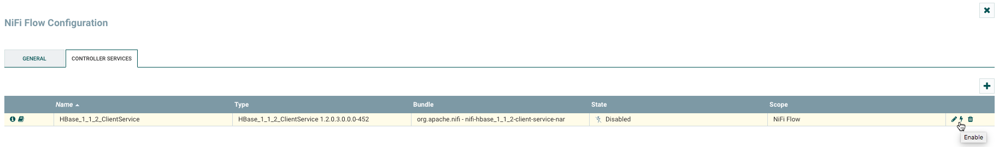

# Populate HDP HBase with HDF NiFi Flow

## Giới thiệu

Trong bài hướng dẫn trước, bạn đã chuyển dữ liệu cảm biến thô từ MiNiFi đến HDF NiFi và HDP HDFS. Bây giờ, bạn sẽ làm phong phú thêm luồng NiFi bằng cách thêm các thuộc tính vị trí địa lý vào bộ dữ liệu. Sau đó, bạn sẽ chuyển đổi dữ liệu thành định dạng JSON để lưu vào HBase.

## Yêu cầu tiên quyết

- Triển khai IoT Weather Station và Connected Data Architecture
- Thu thập dữ liệu thời tiết từ cảm biến Sense HAT thông qua CDA

## Mục lục

- [Bước 1: Tạo Bảng HBase](#step-1-create-hbase-table)
- [Bước 2: Nâng cao Luồng NiFi để Lưu Dữ liệu Địa lý vào HBase](#step-2-enhance-nifi-flow-to-store-geo-data-to-hbase)
- [Bước 3: Xác minh Bảng HBase đã được điền](#step-3-verify-hbase-table-populated)
- [Tóm tắt](#summary)
- [Đọc thêm](#further-reading-4)

### Bước 1: Tạo Bảng HBase

Tạo bảng "sense_hat_logs"

1. Truy cập giao diện dòng lệnh HDP Sandbox tại [Web Shell Client](http://sandbox-hdp.hortonworks.com:4200).

> Lưu ý: Tên người dùng/Mật khẩu là `root` và chuỗi bạn đã đặt làm mật khẩu.

2. Mở HBase Shell:

~~~bash
hbase shell
~~~

3. Tạo Bảng HBase:

~~~bash
create 'sense_hat_logs','weather'
~~~

> Lưu ý: Tên bảng là 'sense_hat_logs' và gia đình cột là 'weather'

Bây giờ, NiFi sẽ có một nơi để lưu trữ dữ liệu cảm biến.

### Bước 2: Nâng cao Luồng NiFi để Lưu Dữ liệu Địa lý vào HBase

Trong phần này, bạn sẽ tải xuống và nhập một biểu mẫu Luồng Dữ liệu NiFi được xây sẵn
vào NiFi, nhưng bạn sẽ cần thực hiện một số sửa đổi trên nó. Biểu mẫu có tên **WeatherDataMiNiFiToHBase**. Bạn sẽ đi qua
từng bước một từng thành phần trong Luồng NiFi để xem cách luồng được xây dựng.

1. Tải xuống tệp mẫu [WeatherDataMiNiFiToHbase.xml](assets/tutorial4/WeatherDataMiNiFiToHbase.xml) về máy tính của bạn.

2. Truy cập giao diện NiFi tại [http://sandbox-hdf.hortonworks.com:9090/nifi](http://sandbox-hdf.hortonworks.com:9090/nifi).

3. Sử dụng biểu tượng mẫu  nằm trong Bảng công cụ Thao tác.

3. **Duyệt**, tìm tệp mẫu, nhấp vào **Mở** và nhấn **Nhập**.

4. Từ **Thanh công cụ Các thành phần**, kéo biểu tượng mẫu  lên đồ thị và chọn tệp mẫu **WeatherDataMiNiFiToHBase**.

5. Loại bỏ hàng đợi giữa **Copy of From_MiNiFi** và **PreProcessDataForHBaseAndHadoop** bằng cách nhấp chuột phải vào hàng đợi, sau đó chọn **Xóa**.

**Hình 1:** Xóa Hàng đợi và sau đó Cổng đầu vào

6. Loại bỏ cổng đầu vào **Copy of From_MiNiFi** bằng cách nhấp chuột phải vào nó, chọn **Xóa**.

7. Kết nối cổng đầu vào **From_MiNiFi** với Nhóm Xử lý **PreProcessDataForHBaseAndHadoop**. Khi cửa sổ **Tạo Kết nối** xuất hiện, chọn **THÊM**.

**Hình 2:** Kết nối Cổng đầu vào từ MiNiFi với Nhóm Xử lý

8. Vào Nhóm Xử lý **PreProcessDataForHBaseAndHadoop** bằng cách nhấp đôi vào nó.

**Hình 3:** Kiểm tra các bộ xử lý trong Nhóm Xử lý

9. Bạn sẽ cần cấu hình lại bộ xử lý GeoEnrichIP. Hiện tại, nó có **đường dẫn thư mục sai** đến Tệp Dữ liệu Cơ sở dữ liệu GeoLite.

Lấy đường dẫn đầy đủ đến GeoLite DB đã được lấy được ở phần **Triển khai IoT Weather Station qua bài hướng dẫn Connected Data Architecture** phần **3.4: Thêm cơ sở dữ liệu GeoLite2 vào máy ảo HDF CentOS**. Cập nhật **Tệp Cơ sở dữ liệu MaxMind** với `/sandbox/tutorial-files/820/nifi/input/GeoFile/GeoLite2-City_[ngày-cập-nhật]/GeoLite2-City.mmdb` nơi [ngày-cập

-nhật] là ngày mới nhất khi tệp cơ sở dữ liệu GeoLite được cập nhật.

**Hình 4:** Chỉ định đường dẫn đầy đủ đến GeoLit2-City.mmdb

Cấu hình đã được Cập nhật với Đường dẫn Thư mục Chính xác

Nhấp vào breadcrum Luồng NiFi ở góc dưới cùng bên trái để quay lại cấp độ gốc.

**Hình 5:** Breadcrum Luồng NiFi

10. Cấu hình Dịch vụ Khách HBase cho **PutHBaseJSON**. Chuột phải vào **PutHBaseJSON**, chọn **Cấu hình**. Chuyển đến tab **Thuộc tính**. Nhấp vào **mũi tên**
để điều hướng đến cấu hình Dịch vụ Khách HBase hiện tại, bạn sẽ kích hoạt nó.

**Hình 6:** Đi đến Dịch vụ Khách HBase từ PutHBaseJSON

11. Kích hoạt Dịch vụ Khách HBase, nhấp vào biểu tượng tia chớp.

**Hình 7:** Kích hoạt Dịch vụ Khách HBase
---
12. **Cửa sổ Bật Dịch vụ Điều khiển** xuất hiện, nhấp vào **BẬT (ENABLE)**.

**Hình 8:** Cửa sổ để Bật Dịch vụ Khách HBase

Khi Dịch vụ Khách HBase được bật như hình dưới đây:

**Hình 9:** Dịch vụ Khách HBase Đã Bật

Nhấp vào nút **X** ở góc trên bên phải. Chúng ta sẽ đi qua Luồng NiFi được làm giàu bằng GeoEnriched, sau đó bắt đầu phần vừa kết nối với cổng đầu vào.

13\. Phân tích Luồng NiFi được làm giàu bằng GeoEnriched:

- **Cổng Đầu vào (Input Port)**: **From_MiNiFi** thu thập dữ liệu cảm biến từ trình MiNiFi đang chạy trên Raspberry Pi. Tên cổng này phải khớp với tên được chỉ định bởi thuộc tính mối quan hệ của cổng đầu vào trên nhóm quy trình từ xa MiNiFi, nếu không, NiFi sẽ không nhận dữ liệu từ MiNiFi. **From_MiNiFi** gửi dữ liệu thời tiết thô đến một thư mục HDFS và đến Nhóm Xử lý **PreProcessDataForHBaseAndHadoop**.

- **PutHDFS**: Bộ xử lý PutHDFS đầu tiên được kết nối với **From_MiNiFi**, lưu trữ dữ liệu thời tiết thô vào thư mục HDP HDFS `/sandbox/tutorial-files/820/nifi/output/raw-data`.

| Thuộc tính | Giá trị    |
| :-------------: | :-------------: |
| Cấu hình Hadoop | `/etc/hadoop/conf/core-site.xml` |
| Thư mục | `/sandbox/tutorial-files/820/nifi/output/raw-data` |

- **Nhóm Xử lý PreProcessDataForHBaseAndHadoop**: nhóm quy trình này bao gồm nhiều thành phần (bộ xử lý, cổng, v.v.) xử lý trước dữ liệu. Một cổng đầu vào (ingestRawData), ExtractText, GeoEnrichIP, RouteOnAttribute, AttributesToJSON, UpdateAttribute, cổng đầu ra (sendProcessedData).

| Thành phần | Mô tả    |
| :-------------: | :-------------: |
| Cổng Đầu vào (Input Port) | Cổng ingestRawData rút dữ liệu từ NiFi bên ngoài (Luồng NiFi) |
| ExtractText | Sử dụng biểu thức regex để trích xuất giá trị dữ liệu thời tiết  |
| GeoEnrichIP | Thêm thông tin địa lý vào luồng từ địa chỉ IP |
| RouteOnAttribute | Định tuyến dữ liệu nếu Thông tin địa lý và Đọc dữ liệu thời tiết hợp lệ |
| AttributesToJSON | Chuyển đổi dữ liệu thành định dạng JSON |
| UpdateAttribute | Cập nhật tên tệp mỗi dữ liệu với một tên duy nhất |
| Cổng Đầu ra (Output Port) | sendProcessedData đầu ra dữ liệu về bên ngoài NiFi (Luồng NiFi) |

- **ExtractText**: Trích xuất giá trị từ văn bản bằng cách sử dụng biểu thức regex Java và lưu giữ những giá trị đó vào các thuộc tính. Gửi dữ liệu đến phần còn lại của luồng chỉ khi có sự khớp của biểu thức regex. **Include Capture Group 0** được đặt thành false để đảm bảo mỗi biểu thức chính quy chỉ có một nhóm duy nhất để tránh giá trị trùng lặp với **<attribute-name>.0**.

| Thuộc tính | Giá trị    |
| :-------------: | :-------------: |
| Bao gồm Capture Group 0 | `false`    |
| Humidity | `(?<=Humidity_PRH = )([\w+.-]+)`    |
| Pressure_In     | `(?<=Pressure_In = )([\w+.-]+)`      |
| Public_IP     | `(?<=Public_IP = )([\w+.-]+)`      |
| Serial | `(?<=Serial = )([\w+.-]+)`    |
| Temp_F     | `(?<=Temperature_F = )([\w+.-]+)`      |
| Timestamp     | `(?<=")([^\"]+)`      |

- **GeoEnrichIP**: Lấy Địa chỉ IP Công cộng từ Raspberry Pi và tạo các thuộc tính địa lý cho Vĩ độ, Kinh độ, Thành phố, Quốc gia, Tiểu bang (IP.geo.latitude, IP.ge.longitude, IP.geo.city, IP.geo.country và IP.geo.subdivision.isocode.N). GeLite2-City_[ngày-cập-nhật], ngày-cập-nhật đại diện cho ngày cuối cùng cơ sở dữ liệu được cập nhật. Chúng ta đã thay đổi đường dẫn trước đó
vì mỗi khi cơ sở dữ liệu GeoLite được tải xuống, tên thư mục thay đổi.

| Thuộc tính | Giá trị    |
| :-------------: | :-------------: |
| MaxMind Database File     | `/sandbox/tutorial-files/820/nifi/input/GeoFile/GeoLite2-City_[ngày-version]/GeoLite2-City.mmdb`      |
| IP Address Attribute     | `Public_IP`      |

> Ví dụ: MaxMind Database File = /sandbox/tutorial-files/820/nifi/input/GeoFile/GeoLite2-City_20170704/GeoLite2-City.mmdb

- **RouteOnAttribute**: Sử dụng ngôn ngữ biểu thức

 NiFi (tương tự ngôn ngữ biểu thức Java) để định tuyến các Thuộc tính đến Luồng Dữ liệu còn lại dựa trên các tiêu chí dữ liệu thời tiết, chẳng hạn như dải tiêu chuẩn của Áp suất nằm giữa 1080 và 870.

Dưới đây là Các Biểu thức NiFi được sử dụng để xác định các điều kiện cho từng FlowFile để chuyển đến các bộ xử lý còn lại:

| Thuộc tính | Giá trị    |
| :-------------: | :-------------: |
| Kiểm tra Thành phố     | `${Public_IP.geo.city:isEmpty():not()}`      |
| Kiểm tra Địa chỉ IP     | `${Public_IP:isEmpty():not()}`      |
| Kiểm tra Áp suất     | `${Pressure_In:lt(32):and(${Pressure_In:gt(26)})}`      |
| Kiểm tra Serial     | `${Serial:isEmpty():not()}`      |
| Kiểm tra Tiểu bang     | `${Public_IP.geo.subdivision.isocode.0:isEmpty():not()}`      |
| Kiểm tra Nhiệt độ     | `${Temp_F:lt(190.4)}`      |
| Kiểm tra Thời gian     | `${Time:isEmpty():not():and(${Timestamp:isEmpty():not()})}`      |

- **AttributesToJson**: Lấy tên và giá trị thuộc tính, sau đó biểu diễn chúng dưới định dạng JSON

| Thuộc tính | Giá trị    |
| :-------------: | :-------------: |
| **Danh sách Thuộc tính**     | `Time, Timestamp, Public_IP.geo.city, Public_IP.geo.subdivision.isocode.0, Serial, Temp_F, Humidity, Pressure_In`      |

- **UpdateAttribute**: Sửa đổi tên tệp của mỗi FlowFile để làm cho chúng khác nhau.

| Thuộc tính | Giá trị    |
| :-------------: | :-------------: |
| **Tên tệp**     | `weatherdata-${now():format("yyyy-MM-dd-HHmmssSSS")}-${UUID()}.json`      |

- **Cổng Đầu ra (Output Port)**: sendProcessedData đầu ra dữ liệu về bên ngoài NiFi (Luồng NiFi), sau đó được định tuyến đến bộ xử lý PutHBaseJSON và một bộ xử lý PutHDFS khác.

- **PutHBaseJSON**: Lưu trữ Dữ liệu được làm giàu bằng GeoEnriched từng hàng vào bảng HBase ‘sense_hat_logs’ hàng.

| Thuộc tính | Giá trị    |
| :-------------: | :-------------: |
| **Dịch vụ Khách HBase**     | **HBase_1_1_2_ClientService**       |
| **Tên Bảng**     | **sense_hat_logs**       |
| Tên Trường Nhận dạng Hàng     | Timestamp       |
| Chiến lược Mã hóa Tên Trường Nhận dạng Hàng     | String       |
| **Gia đình Cột**     | **weather**       |
| **Kích thước Lô**     | **25**       |
| **Chiến lược Trường Phức tạp**     | **Text**       |
| **Chiến lược Mã hóa Trường**     | **String**       |

- **PutHDFS**: Lưu trữ Dữ liệu được làm giàu bằng GeoEnriched vào thư mục HDP HDFS `/sandbox/tutorial-files/820/nifi/output/geoenriched-data`.

| Thuộc tính | Giá trị    |
| :-------------: | :-------------: |
| Cấu hình Hadoop | `/etc/hadoop/conf/core-site.xml` |
| Thư mục | `/sandbox/tutorial-files/820/nifi/output/geoenriched-data` |

14\. Giữ phím Shift, nhấp chuột và di chuột qua Nhóm Xử lý PreProcessDataForHBaseAndHadoop, PutHBaseJSON và PutHDFS sau đó nhả chuột. Ba thành phần này sẽ được đánh dấu.

15\. Nhấn nút **Bắt đầu (start)**  để kích hoạt phần này của luồng.

**Hình 10:** Luồng NiFi đã được kích hoạt

### Bước 3: Xác nhận Bảng HBase Đã Được Điền Dữ liệu

1\. Trở lại Trình Duyệt Web Shell HDP tại http://sandbox-hdp.hortonworks.com:4200

> Lưu ý: user/password là root và chuỗi mật khẩu bạn đã đặt.

Nếu shell HBase đã đóng, mở nó lên:

~~~bash
hbase shell
~~~

2\. Sử dụng lệnh **scan** của HBase để kiểm tra xem bảng có chứa dữ liệu không:

~~~bash
scan 'sense_hat_logs'
~~~

3\. Bảng nên được điền đầy dữ liệu thời tiết:

**Hình 11:** Bảng HBase Đã Được Điền Dữ liệu

### Tóm tắt

Chúc mừng bạn vừa cải thiện luồng NiFi trước đó để thu thập thông tin địa lý bằng **GeoEnrichIP** dựa trên địa chỉ IP công cộng của Raspberry Pi, từ đó bạn có thể xác định thành phố và tiểu bang nơi các đọc dữ liệu thời tiết được lấy từ. Thêm vào đó, bạn đã tạo một bảng HBase giúp NiFi lưu trữ dữ liệu này vào HDP.
