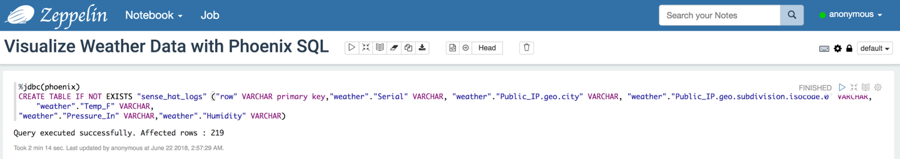
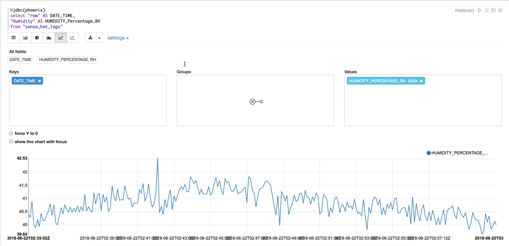

# Hiển thị Dữ liệu Thời tiết bằng Trình Phiên dịch Phoenix của Zeppelin

## Giới thiệu

Trong phần này, bạn sẽ sử dụng Phoenix để thực hiện các truy vấn SQL đối với bảng HBase bằng cách ánh xạ một bảng Phoenix với bảng HBase. Bạn sẽ hiển thị kết quả của mình bằng cách chạy Phoenix trong Zeppelin thông qua Trình Phiên dịch Phoenix. Bạn sẽ theo dõi các đọc số nhiệt độ, độ ẩm và áp suất không khí thông qua Biểu đồ Đường, Biểu đồ Cột, Biểu đồ Tròn và Hiển thị Bản đồ.

## Điều kiện tiên quyết

- Triển khai Trạm Thời tiết IoT và Kiến trúc Dữ liệu Kết nối
- Thu thập Dữ liệu Thời tiết Sense HAT qua CDA
- Điền dữ liệu vào HDP HBase với Luồng NiFi HDF

## Đường dẫn

- [Bước 1: Tạo Sổ tay Zeppelin](#bước-1-tạo-sổ-tay-zeppelin)
- [Bước 2: Tạo Bảng Phoenix Ánh xạ với Bảng HBase](#bước-2-tạo-bảng-phoenix-ánh-xạ-với-bảng-hbase)
- [Bước 3: Theo dõi Nhiệt độ Theo Thời gian](#bước-3-theo-dõi-nhiệt-độ-theo-thời-gian)
- [Bước 4: Theo dõi Độ ẩm Theo Thời gian](#bước-4-theo-dõi-độ-ẩm-theo-thời-gian)
- [Bước 5: Theo dõi Áp suất Không khí Theo Thời gian](#bước-5-theo-dõi-áp-suất-không-khí-theo-thời-gian)
- [Tóm tắt](#tóm-tắt)
- [Đọc thêm](#đọc-thêm)

### Bước 1: Tạo Sổ tay Zeppelin

Chọn sổ tay bên cạnh biểu tượng Zeppelin, và nhấn “Tạo sổ tay mới” để tạo Sổ tay Zeppelin. Đặt tên là `Hiển thị Dữ liệu Thời tiết với SQL Phoenix`. Chọn "Trình Phiên dịch Mặc định" như là **jdbc**.

### Bước 2: Tạo Bảng Phoenix Ánh xạ với Bảng HBase

Chúng ta phải tạo một bảng Phoenix để ánh xạ với bảng HBase của chúng ta để thực hiện các truy vấn SQL đối với HBase. Viết hoặc Sao chép/Dán các truy vấn sau vào trình soạn thảo Zeppelin.

~~~SQL
%jdbc(phoenix)
CREATE TABLE IF NOT EXISTS "sense_hat_logs" ("row" VARCHAR primary key,"weather"."Serial" VARCHAR, "weather"."Public_IP.geo.city" VARCHAR, "weather"."Public_IP.geo.subdivision.isocode.0" VARCHAR, "weather"."Temp_F" VARCHAR,
"weather"."Pressure_In" VARCHAR,"weather"."Humidity" VARCHAR)
~~~

**Hình ảnh 1:** Bảng Phoenix đã được tạo

Chạy một bài kiểm tra nhanh để xác minh bảng Phoenix đã được ánh xạ thành công với bảng HBase.

Hiển thị 10 hàng đầu tiên của bảng Phoenix bằng **Trình Biểu đồ** của Zeppelin.

~~~SQL
%jdbc(phoenix)
select * from "sense_hat_logs" limit 10
~~~

**Hình ảnh 2:** Trình Biểu đồ của Zeppelin

### Bước 3: Theo dõi Nhiệt độ Theo Thời gian

~~~SQL
%jdbc(phoenix)
select "row" AS DATE_TIME,
"Temp_F" AS TEMP_F
from "sense_hat_logs"
~~~

**Hình ảnh 3:** Biểu đồ Đường Nhiệt độ

Biểu đồ này cho thấy nhiệt độ đạt mức cao nhất là 100.72 độ F (lúc 23:51, ngày 9 tháng 7 năm 2017) và thấp nhất là 94.71 độ F (lúc 23:34, ngày 9 tháng 7 năm 2017).

Như bạn có thể thấy, ngay cả sau khi chúng ta đã cố gắng hiệu chuẩn nhiệt độ của Sense HAT, nhiệt độ vẫn không chính xác so với nhiệt độ thực tế trong phòng sống. Giải pháp tốt nhất là đưa Sense HAT ra xa Raspberry Pi, nhưng điều này sẽ làm mất mục đích của Sense HAT khi nó trở nên rất nhỏ gọn.

### Bước 4: Theo dõi Độ ẩm Theo Thời gian

Độ ẩm là tỷ lệ giữa hơi nước thực tế trong không khí so với lượng hơi nước thực tế mà không khí có thể giữ ở một nhiệt độ cụ thể. Độ ẩm tương đối cho chúng ta biết không khí đang bão hòa đến mức nào. Nhiệt độ không khí càng cao, độ ẩm tương đối càng thấp và ngược lại.

~~~SQL
%jdbc(phoenix)
select

 "row" AS DATE_TIME,
"Humidity" AS HUMIDITY_Percentage_RH
from "sense_hat_logs"
~~~

**Hình ảnh 4:** Biểu đồ Đường Độ ẩm

Biểu đồ trên cho thấy Phần trăm Độ ẩm Tương đối đạt đến mức cao nhất khoảng 40.8% (lúc 23:00, ngày 9 tháng 7 năm 2017) trong khi thấp nhất là 33.75% (lúc 23:52, ngày 9 tháng 7 năm 2017). Ở 40.8%, không khí được bão hòa hơn so với 33.75%. Độ ẩm Tương đối

### Bước 5: Theo dõi Áp suất Không khí Theo Thời gian

Áp suất Không khí là lực tác động của không khí tại một điểm cụ thể. Người dự báo theo dõi sự thay đổi trong áp suất không khí để dự đoán thay đổi ngắn hạn trong thời tiết.

~~~SQL
%jdbc(phoenix)
select "row" AS DATE_TIME,
"Pressure_In" AS PRESSURE
from "sense_hat_logs"
~~~

**Hình ảnh 5:** Biểu đồ Đường Áp suất

Biểu đồ trên cho thấy áp suất không khí giữ ổn định ở mức khoảng 29.98 và 29.97 từ 22:42 ngày 9 tháng 7 năm 2017 đến 00:22 ngày 10 tháng 7 năm 2017.

Sau khi so sánh áp suất cho San Jose tại "The Weather Channel," các đọc số chúng tôi nhận được nằm trong khoảng giống nhau. The Weather Channel dự đoán rằng áp suất sẽ tăng từ 29.90 inches. Biểu đồ của chúng tôi cũng hỗ trợ dự đoán đó. Sự **tăng áp suất** này cho thấy thời tiết có thể sớm **quang đãng**, trở nên **ấm áp** và **nắng**.

### Tóm tắt

Chúc mừng bạn! Bây giờ bạn biết cách viết các truy vấn SQL Phoenix đối với bảng HBase. Bạn đã thực hiện các truy vấn giống như SQL của Phoenix đối với HBase để theo dõi nhiệt độ, độ ẩm và áp suất theo thời gian. Bạn cũng biết cách sử dụng Trình Phiên dịch Phoenix tích hợp với Zeppelin để hiển thị dữ liệu liên quan đến cảm biến thời tiết của mình. Hãy thoải mái khám phá thêm về các Trình Phiên dịch Zeppelin khác và các biểu đồ trực quan khác cho hành trình phân tích dữ liệu của bạn.

### Đọc thêm

- Đọc thêm về Zeppelin tại [Apache Zeppelin Docs](https://zeppelin.apache.org/)
- Đọc thêm về Phoenix tại [Apache Phoenix Docs](https://phoenix.apache.org/)
